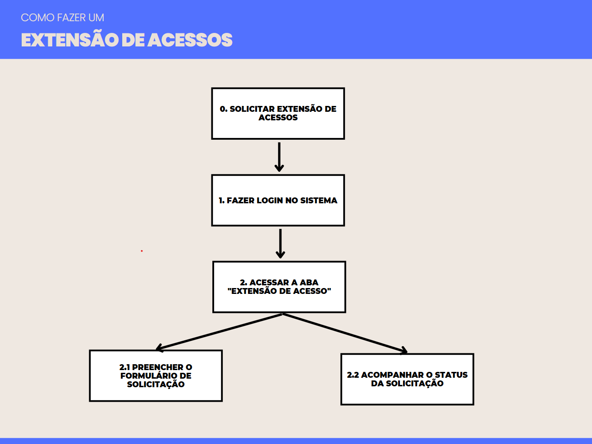

## Introdução

A Análise Hierárquica de Tarefas (HTA) é um método de análise de tarefas que visa representar e decompor uma tarefa complexa em uma hierarquia de objetivos, subobjetivos e operações, a fim de facilitar a compreensão de como um usuário realiza uma tarefa e permitir que sejam identificados pontos problemáticos e de melhoria. A HTA é amplamente utilizada em diversos contextos, como no desenvolvimento de produtos, serviços e na melhoria de processos. Ela pode ser representada por uma tabela, ou por um diagrama, com a notação conforme a figura 1.

<b>Figura 1 </b> - Notação diagrama HTA.

{width: 300}

<b>Fonte:</b> BARBOSA e SILVA, 2011.

## Análise de Tarefas

No que diz respeito às tarefas para análise com o método HTA, foram escolhidas o acesso ao meu painel e o compartilhamento de eventos, conforme explicitado nas figuras de __ a __ e nas tabelas de __ a __.

### Extensão de Acessos

Nessa tarefa, o usuário possui o objetivo de visualizar um pedido dentro dos pedidos realizados. A figura 2 apresenta o diagrama HTA relativa a tarefa, já a tabela 1 representa o mesmo HTA em tabela

Nessa tarefa, o usuário possui o objetivo fazer uma solicitação de extensão de acessos do seu cartão do passe livre estudantil. A figura __ apresenta o diagrama HTA relativa a tarefa, já a tabela __ representa o mesmo HTA em tabela

<b>Figura __</b> - Diagrama HTA de Extensão de Acessos.

{width: 300}

Fonte: [Breno Fernandes](https://github.com/Brenofrds).

<b>Tabela __</b> - HTA de Extensão de Acessos.

| **Objetivos/Operações**             | **Problemas e Recomendações**                                                                    |
|-------------------------------------|-------------------------------------------------------------------------------------------------|
| **0. Solicitar extensão de acessos** | Garantir que todos os campos sejam preenchidos corretamente e os documentos anexados.          |
| **1. Fazer login no sistema**       | Pode haver falhas de autenticação; exibir mensagens claras de erro ao usuário.                 |
| **1.1. Inserir login e senha**      | Certificar-se de que o campo de senha está seguro e funcional.                                 |
| **1.2. Confirmar autenticação**     | Redirecionar o usuário corretamente para a página inicial após o login.                       |
| **2. Acessar a aba "Extensão de Acesso"** | A aba deve ser facilmente localizável no menu.                                                 |
| **2.1. Localizar a aba no menu principal** | Garantir que o menu seja acessível em diferentes dispositivos (computadores e celulares).      |
| **2.2. Clicar na aba para abrir a página** | Certificar-se de que o carregamento da página seja rápido e sem erros.                       |
| **3. Preencher o formulário de solicitação** | Validar todos os campos obrigatórios e os arquivos anexados antes do envio.                  |
| **3.1. Ler e aceitar o Termo de Uso** | O texto do termo deve ser claro e objetivo, permitindo fácil compreensão pelo usuário.         |
| **3.2. Selecionar o motivo da solicitação** | Listar os motivos disponíveis de forma clara e objetiva.                                      |
| **3.3. Preencher os campos obrigatórios** | Exibir mensagens de erro em tempo real caso algum campo obrigatório não seja preenchido.      |
| **3.4. Anexar os documentos necessários** | Garantir suporte para os formatos indicados e informar os limites de tamanho.                |
| **3.5. Confirmar o envio do formulário** | Informar ao usuário que a solicitação foi enviada com sucesso, exibindo uma mensagem clara.  |
| **4. Acompanhar o status da solicitação** | O status da solicitação deve ser atualizado em tempo real e exibir informações claras.        |
| **4.1. Acessar a aba "Acompanhar Solicitações"** | Certificar-se de que a aba seja facilmente acessível pelo menu.                              |
| **4.2. Verificar o status atual da solicitação** | Exibir os status ("Solicitado", "Em análise", "Aprovado", "Rejeitado") de forma clara.        |

Fonte: [Breno Fernandes](https://github.com/Brenofrds).

