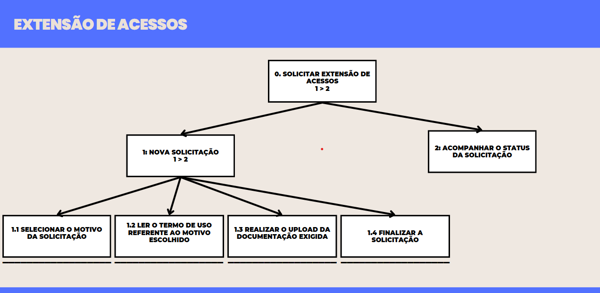
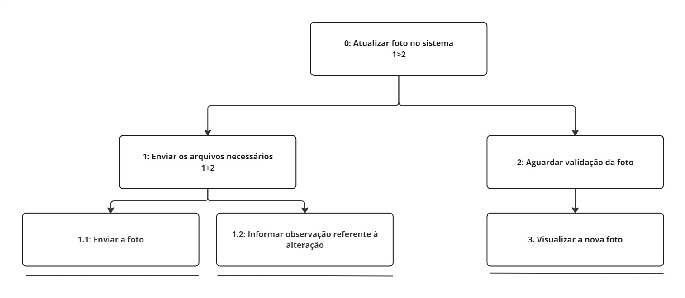
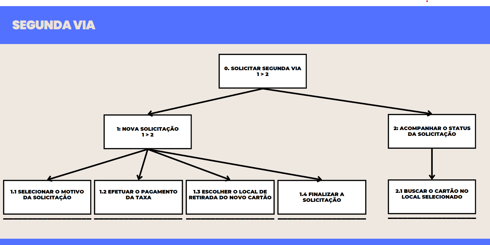
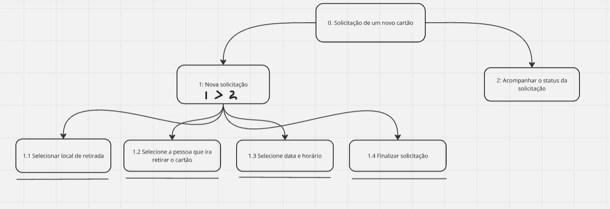

# Análise Hierárquica de Tarefas (HTA)

## Introdução

A Análise Hierárquica de Tarefas (HTA) é um método de análise de tarefas que visa representar e decompor uma tarefa complexa em uma hierarquia de objetivos, subobjetivos e operações, a fim de facilitar a compreensão de como um usuário realiza uma tarefa e permitir que sejam identificados pontos problemáticos e de melhoria. A HTA é amplamente utilizada em diversos contextos, como no desenvolvimento de produtos, serviços e na melhoria de processos. Ela pode ser representada por uma tabela, ou por um diagrama, com a notação conforme a figura 1.

<b>Figura 1 </b> - Notação diagrama HTA.

<b>Fonte:</b> BARBOSA e SILVA, 2011.

## Análises Realizadas:

No que diz respeito às tarefas para análise com o método HTA, foram escolhidos alguns cenários para serem descritos com esse método, como poderemos ver abaixo:

### Cenário 2: Extensão de Acessos

Nessa tarefa, o usuário possui o objetivo fazer uma solicitação de extensão de acessos do seu cartão do passe livre estudantil. A figura 1 apresenta o diagrama HTA relativa a tarefa, já a tabela 1 representa o mesmo HTA em tabela

<b>Figura 1</b> - Diagrama HTA de Extensão de Acessos.

Fonte: [Breno Fernandes](https://github.com/Brenofrds).

<b>Tabela 1</b> - HTA de Extensão de Acessos.

| **Objetivos / Operações**                                                                                                                                                | **Problemas e Recomendações**                                                                                                                                                                                                                          |
| ------------------------------------------------------------------------------------------------------------------------------------------------------------------------ | ------------------------------------------------------------------------------------------------------------------------------------------------------------------------------------------------------------------------------------------------------ |
| **0. Solicitar Extensão de Acessos 1 > 2**                                                                                                                               | _plano_: seguir todas as etapas de forma sequencial para garantir que os termos de uso sejam apresentados corretamente de acordo com o motivo escolhido.                                                                                               |
| **1. Nova Solicitação 1 > 2**                                                                                                                                            | _problema_: anteriormente, essa etapa era paralela, o que dificultava a apresentação dos termos específicos.   _recomendação_: o fluxo foi ajustado para ser sequencial, garantindo que o termo de uso seja exibido logo após a seleção do motivo. |
| **1.1 Selecionar o motivo da solicitação**                                                                                                                               |                                                                                                                                                                                                                                                        |
| **1.2 Ler o termo de uso referente ao motivo escolhido**                                                                                                                 | _problema_: termos extensos podem desmotivar a leitura.   _recomendação_: mostrar os termos de acordo com a escolha do motivo da solicitação                                                                                                       |
| **1.3 Realizar o upload da documentação exigida**                                                                                                                        | _problema_: ao realizar o upload do documento, o usuário não tem a opção de excluir ou editar o arquivo antes de enviar a solicitação.                                                                                                                 |
| _recomendação_: permitir que o usuário revise, substitua ou exclua o arquivo enviado antes de concluir a solicitação, garantindo maior controle sobre os dados enviados. |
| **1.4 Finalizar a solicitação**                                                                                                                                          |                                                                                                                                                                                                                                                        |
| **2. Acompanhar o status da solicitação**                                                                                                                                |                                                                                                                                                                                                                                                        |

Fonte: [Breno Fernandes](https://github.com/Brenofrds).

### Cenário 04 - Alteração de Foto

| **Objetivos / Operações**                         | **Problemas e Recomendações**                                                                                                                                                                                                                                   |
| ------------------------------------------------- | --------------------------------------------------------------------------------------------------------------------------------------------------------------------------------------------------------------------------------------------------------------- |
| **0. Alterar a foto do cartão 1>2**               | _input_: arquivo de foto do usuário   _feedback_: foto do usuário atualizada na tela de início   _plano_: enviar o arquivo de foto para que seja validado e após isso alterado   _recomendação_: enviar foto centralizada do rosto com fundo branco |
| **1. Enviar os arquvios necessários 1+2**         | _plano_: enviar a foto e informar observação caso seja necessário                                                                                                                                                                                               |
| **1.1 Enviar a foto**                             |                                                                                                                                                                                                                                                                 |
| **1.2 Informar observação referente à alteração** |                                                                                                                                                                                                                                                                 |
| **2. Aguardar validação da foto**                 |                                                                                                                                                                                                                                                                 |
| **3. Visualizar a nova foto**                     |                                                                                                                                                                                                                                                                 |

Fonte: [Mateus Viera](https://github.com/matix0).

### Cenário 5: Verificação de acessos em um dia específico

| **Objetivos / Operações**                                                      | **Problemas e Recomendações**                                                                                                                                                  |
| ------------------------------------------------------------------------------ | ------------------------------------------------------------------------------------------------------------------------------------------------------------------------------ |
| **0. Verificar os acessos realizados em um dia específico**                    | _feedback_: Registros de acessos exibidos na tela   _plano_: Navegar até a aba correta, selecionar as datas e visualizar os resultados.                                    |  |
| **1. Identificar a aba "Meus Acessos" no menu**                                |                                                                                                                                                                                |
| **1.1 Clicar na aba "Meus Acessos"**                                           |                                                                                                                                                                                |
| **2. Selecionar as datas para a consulta**                                     | _plano_: Preencher os campos de data de início e fim para filtrar os registros corretamente.                                                                                   |
| **2.1 Localizar os campos para inserir as datas de início e fim**              |                                                                                                                                                                                |
| **2.2 Preencher as datas desejadas**                                           | _problema_: Formato de data pode ser confuso para o usuário.   _recomendação_: Implementar um seletor de datas (date picker) para facilitar a entrada de dados.            |
| **2.3 Confirmar as datas selecionadas**                                        | _problema_: Falta de botão ou indicador claro de confirmação.   _recomendação_: Utilizar botões evidentes como "Confirmar" ou "Filtrar".                                   |
| **3. Visualizar as informações de acessos**                                    | _plano_: Conferir os registros carregados na tela, verificando a exatidão dos dados apresentados.                                                                              |
| **3.1 Aguardar o carregamento das informações**                                | _problema_: Carregamento demorado pode gerar frustração.   _recomendação_: Exibir uma barra ou indicador de progresso durante o carregamento.                              |
| **3.2 Conferir os registros exibidos, incluindo horários e locais de entrada** | _problema_: Informações podem ser extensas ou difíceis de interpretar.   _recomendação_: Exibir os dados em tabelas ou gráficos de fácil leitura, com opção de exportação. |

---

### Cenário 7: Segunda via

Nessa tarefa, o usuário possui o objetivo fazer uma solicitação de segunda via do seu cartão do passe livre estudantil. A figura ** apresenta o diagrama HTA relativa a tarefa, já a tabela ** representa o mesmo HTA em tabela

<b>Figura \_\_</b> - Diagrama HTA de Segunda via.

Fonte: [Breno Fernandes](https://github.com/Brenofrds).

<b>Tabela \_\_</b> - HTA de Segunda via.

| **Objetivos / Operações**                           | **Problemas e Recomendações**                                                                                                                                                                                                                                                                                                                                                                                                                                         |
| --------------------------------------------------- | --------------------------------------------------------------------------------------------------------------------------------------------------------------------------------------------------------------------------------------------------------------------------------------------------------------------------------------------------------------------------------------------------------------------------------------------------------------------- |
| **0. Solicitar Segunda Via 1 > 2**                  | _plano_: seguir todas as etapas de forma sequencial, garantindo que o pagamento e a escolha do local de retirada sejam realizados diretamente na plataforma para maior conveniência.                                                                                                                                                                                                                                                                                  |
| **1. Nova Solicitação 1 > 2**                       |                                                                                                                                                                                                                                                                                                                                                                                                                                                                       |
| **1.1 Selecionar o motivo da solicitação**          |                                                                                                                                                                                                                                                                                                                                                                                                                                                                       |
| **1.2 Efetuar o pagamento da taxa**                 | _problema_: anteriormente, o pagamento era realizado presencialmente em uma agência bancária e o usuário precisava enviar manualmente um comprovante com informações como CPF e conta bancária.   _recomendação_: o pagamento agora é feito diretamente na plataforma (boleto, PIX ou cartão de crédito), agilizando o processo e eliminando etapas manuais. Além disso, o sistema reconhece o pagamento automaticamente e bloqueia o cartão perdido de imediato. |
| **1.3 Escolher o local de retirada do novo cartão** | _problema_: anteriormente, o local de retirada não era informado com antecedência, e o usuário não podia escolher onde buscar o cartão.   _recomendação_: o sistema agora sugere automaticamente o local mais próximo da residência do usuário, mas permite que ele altere a escolha para maior conveniência.                                                                                                                                                     |
| **1.4 Finalizar a solicitação**                     |                                                                                                                                                                                                                                                                                                                                                                                                                                                                       |
| **2. Acompanhar o status da solicitação**           |                                                                                                                                                                                                                                                                                                                                                                                                                                                                       |
| **2.1 Buscar o cartão no local selecionado**        |                                                                                                                                                                                                                                                                                                                                                                                                                                                                       |

Fonte: [Breno Fernandes](https://github.com/Brenofrds).

### Cenário 8: Troca de Endereço

| **Objetivos / Operações**                                         | **Problemas e Recomendações**                                                                                                                                                                                                    |
| ----------------------------------------------------------------- | -------------------------------------------------------------------------------------------------------------------------------------------------------------------------------------------------------------------------------- |
| **0. Atualizar o endereço cadastrado na plataforma**              | _input_: Novas informações de endereço fornecidas pelo usuário   _feedback_: Confirmação visual de que o endereço foi atualizado   _plano_: Acessar a aba correta, editar o campo de endereço e confirmar a atualização. |
| **1. Navegar até a aba "Atualizar Cadastro"**                     | _plano_: Usar o menu principal para acessar a funcionalidade de atualização de cadastro.                                                                                                                                         |
| **1.1 Localizar a aba "Atualizar Cadastro" no menu principal**    | _problema_: Usuários podem ter dificuldade em identificar a aba devido a nomes pouco intuitivos.   _recomendação_: Usar um nome claro, como "Editar Dados", e adicionar ícones para facilitar a localização.                 |
| **1.2 Clicar na aba "Atualizar Cadastro"**                        | _problema_: Possíveis atrasos ou erros ao carregar a página.   _recomendação_: Incluir um indicador de progresso para manter o usuário informado sobre o status de carregamento.                                             |
| **2. Inserir as novas informações de endereço**                   | _plano_: Editar diretamente o campo de endereço e salvar as alterações.                                                                                                                                                          |
| **2.1 Navegar até a seção "Endereço"**                            | _problema_: Usuários podem não perceber como acessar a seção desejada.   _recomendação_: Adicionar um menu de navegação lateral ou destacar as seções no topo da página.                                                     |
| **2.2 Editar o campo de endereço com as novas informações**       | _problema_: Possíveis erros no formato do endereço (CEP, estado, etc.).   _recomendação_: Implementar validação em tempo real para evitar entradas inválidas.                                                                |
| **2.3 Salvar as alterações realizadas**                           | _problema_: Botão de salvar pode não estar visível ou ser pouco destacado.   _recomendação_: Garantir que o botão seja grande, de fácil visualização e posicionado em uma área lógica da página (por exemplo, no final).     |
| **3. Confirmar a atualização do endereço**                        | _plano_: Validar se as mudanças foram feitas corretamente através de mensagens de sucesso e confirmação visual.                                                                                                                  |
| **3.1 Verificar a mensagem de sucesso exibida pela plataforma**   | _problema_: Mensagens podem ser muito genéricas ou não aparecer imediatamente.   _recomendação_: Exibir mensagens claras, como "Endereço atualizado com sucesso", em destaque e por tempo adequado.                          |
| **3.2 Confirmar visualmente que o novo endereço está atualizado** | _problema_: Usuários podem não encontrar onde validar o novo endereço.   _recomendação_: Redirecionar automaticamente para a visualização do perfil atualizado ou destacar o campo atualizado na tela atual.                 |

---

### Cenário 9: Criação do Cartão Virtual do Passe Livre Estudantil

| **Objetivos / Operações**                                                                            | **Problemas e Recomendações**                                                                                                                                                                                                                                     |
| ---------------------------------------------------------------------------------------------------- | ----------------------------------------------------------------------------------------------------------------------------------------------------------------------------------------------------------------------------------------------------------------- |
| **0. Obter o cartão virtual do passe livre estudantil**                                              | _input_: Dados do usuário (nome, CPF, número do cartão físico)   _feedback_: Cartão virtual com QR Code exibido na tela e integração com aplicativos   _plano_: Realizar login, navegar até a aba correta, preencher os dados e acessar o cartão virtual. |
| **1. Fazer login na página para acessar a funcionalidade**                                           | _problema_: Usuário pode esquecer as credenciais ou enfrentar problemas com recuperação de senha.   _recomendação_: Oferecer uma opção de recuperação de senha simples e destacada na tela de login.                                                          |
| **2. Navegar até a aba "Cartão Virtual"**                                                            | _plano_: Utilizar o menu principal para localizar e acessar a aba.                                                                                                                                                                                                |
| **2.1 Procurar no menu a opção "Cartão Virtual"**                                                    | _problema_: Nome da aba pode ser pouco intuitivo ou difícil de localizar.   _recomendação_: Garantir que a aba tenha um nome claro e ícones que facilitem a identificação.                                                                                    |
| **2.2 Pressionar a opção para acessá-la**                                                            | _problema_: Possíveis atrasos no carregamento da página.   _recomendação_: Exibir um indicador de progresso para que o usuário saiba que o sistema está processando a solicitação.                                                                            |
| **3. Preencher os dados necessários para criar o cartão virtual**                                    | _plano_: Inserir corretamente as informações exigidas nos campos indicados.                                                                                                                                                                                       |
| **3.1 Inserir nome completo**                                                                        | _problema_: Campo pode não validar corretamente o formato esperado.   _recomendação_: Implementar validação em tempo real para evitar erros e informar o formato adequado ao usuário.                                                                         |
| **3.2 Inserir CPF**                                                                                  | _problema_: Usuários podem digitar o CPF no formato errado.   _recomendação_: Adicionar máscara no campo para formatação automática (ex.: 123.456.789-00).                                                                                                    |
| **3.3 Inserir o número do cartão físico**                                                            | _problema_: Número pode ser longo e propenso a erros de digitação.   _recomendação_: Permitir a digitalização ou leitura automática do cartão físico (se disponível).                                                                                         |
| **3.4 Confirmar os dados pressionando o botão "Gerar Cartão Virtual"**                               | _problema_: Usuário pode não perceber o botão de confirmação.   _recomendação_: Garantir que o botão seja destacado visualmente e que exiba mensagens de erro caso algum campo obrigatório esteja vazio ou preenchido incorretamente.                         |
| **4. Finalizar o processo e acessar o cartão virtual gerado**                                        | _plano_: Exibir o cartão virtual gerado e oferecer opções de integração com outros serviços.                                                                                                                                                                      |
| **4.1 Visualizar o cartão virtual com QR Code na tela**                                              | _problema_: QR Code pode ser de difícil leitura dependendo do tamanho ou resolução.   _recomendação_: Garantir que o QR Code seja grande o suficiente e contrastante para leitura fácil.                                                                      |
| **4.2 Escolher uma das opções para integrar o cartão a aplicativos como Google Pay ou Apple Wallet** | _problema_: Usuários podem não saber como utilizar a integração.   _recomendação_: Adicionar instruções claras sobre como integrar o cartão virtual aos aplicativos suportados.                                                                               |

---
### Cenário 10: Solicitação de retirada de cartão

## Objetivos / Operações e Recomendações

| **Objetivos / Operações**                       | **Problemas e Recomendações**                                                                                       |
|------------------------------------------------|-------------------------------------------------------------------------------------------------------------------|
| **0. Solicitar emissão de um novo cartão**    | **input**: Dados de login do estudante na plataforma; formulário para selecionar opções de retirada.             |
|                                                | **feedback**: Confirmação ao final do processo com os dados da solicitação.                                      |
|                                                | **plano**: Realizar as etapas do processo e exibir mensagem de sucesso após a revisão das informações fornecidas.|
|                                                | **recomendação**: Garantir que todas as etapas sejam intuitivas e oferecer opções claras para o usuário.         |
| **1. Selecionar local de retirada do cartão**  | **plano**: Exibir lista de locais disponíveis para escolha, destacando opções próximas ao endereço do usuário.    |
| **1.1. Exibir locais disponíveis**             |                                                                                                                   |
| **1.2. Confirmar local escolhido**             | **recomendação**: Adicionar um mapa interativo para facilitar a escolha do local.                                |
| **2. Indicar responsável pela retirada**       | **plano**: Oferecer ao usuário a opção de indicar "Eu mesma" ou cadastrar um terceiro responsável.               |
| **2.1. Escolher "Eu mesma"**                  |                                                                                                                   |
| **2.2. Indicar terceiro responsável**          | **problema**: Falta de clareza sobre quais informações do terceiro precisam ser fornecidas.                       |
|                                                | **recomendação**: Exibir um exemplo de preenchimento para os dados do terceiro.                                  |
| **3. Escolher data e horário para retirada**   | **plano**: Exibir calendário interativo com períodos disponíveis para seleção.                                   |
| **3.1. Selecionar dia**                        |                                                                                                                   |
| **3.2. Selecionar horário**                    | **problema**: Calendário pouco responsivo em dispositivos móveis pode dificultar o uso.                          |
|                                                | **recomendação**: Otimizar o calendário para dispositivos móveis e exibir feedback imediato de disponibilidade.   |
| **4. Confirmar solicitação**                   | **ação**: Exibir mensagem de confirmação com detalhes da retirada, incluindo local, data, horário e instrução para apresentar documento de identificação. |
|                                                | **recomendação 1**: Adicionar botão para salvar ou imprimir os dados da confirmação.                             |
|                                                | **recomendação 2**: Enviar notificação por e-mail ou SMS com os dados confirmados para facilitar o acesso ao usuário. |

## Bibliografia

> Barbosa, S. D. J.; Silva, B. S. da; Silveira, M. S.; Gasparini, I.; Darin, T.; Barbosa, G. D. J. (2021) Interação Humano-Computador e Experiência do usuário. Autopublicação.

## Histórico de Revisão

|    Data    | Data Prevista de Revisão | Versão |     Descrição     |                      Autor                      |                  Revisor                   |
| :--------: | :----------------------: | :----: | :---------------: | :---------------------------------------------: | :----------------------------------------: |
| 14/12/2024 |        16/12/2024        |  1.0   | Criação da Página |                    Fernandes                    | [Mateus Vieira](https://github.com/matix0) |
| 16/12/2024 |        17/12/2024        |  1.1   |   Adição HTA 4    |   [Mateus Vieira](https://github.com/matix0)    |                 Fernandes                  |
| 24/12/2024 |        30/12/2024        |  1.2   | Adição HTA 2 e 7  | [Breno Fernandes](https://github.com/Brenofrds) |                  Matheus                   |
