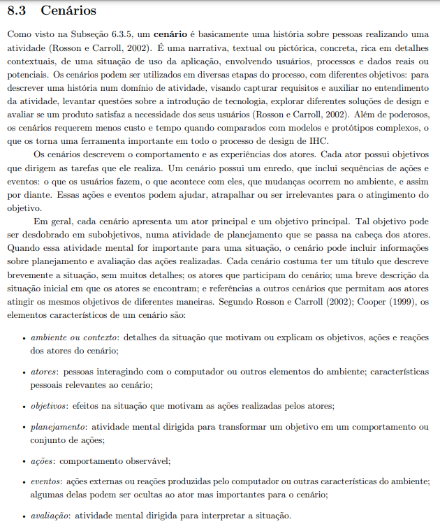

# Cenários

## Introdução
Cenários são narrativas detalhadas que descrevem situações de uso de uma aplicação, envolvendo atores, processos e dados reais ou potenciais. Eles têm como objetivo capturar requisitos, explorar soluções de design e avaliar a satisfação do usuário. Com um custo e tempo menores do que modelos complexos, os cenários são uma ferramenta importante no design de interfaces. Cada cenário apresenta um ator principal, com um objetivo central que pode ser desdobrado em subobjetivos. Além disso, inclui sequências de ações, eventos e planejamento que ajudam ou dificultam o alcance dos objetivos.

Figura 1 - Explicação dos Cenários

Fonte: (BARBOSA, S. D. J.; SILVA, B. S. Interação Humano-Computador. Rio de Janeiro: Elsevier, 2011.)

## Cenário 1: Visualização da obtenção do passe livre

Lucas Oliveira acessa a plataforma pela primeira vez para verificar se seu cartão de passe livre está quase pronto para uso. Como é sua primeira experiência com o benefício, ele deseja se organizar melhor em relação ao processo. Utilizando apenas seu celular, que é seu único meio de acesso à internet fora de casa, ele abre o site pelo Google Chrome. No entanto, encontra dificuldades para navegar devido à baixa responsividade da página. Tentando contornar o problema, ele até muda a orientação da tela, mas ainda assim enfrenta desafios para visualizar o conteúdo. Por fim, consegue entender que seu processo está apenas em análise.

## Cenário 2: Solicitação de segunda via de cartão por perda

Mariana Silva, ao perceber que perdeu seu cartão estudantil, decide realizar as tarefas necessárias para solicitar uma segunda via. Primeiro, ela utiliza suas credenciais para acessar o sistema responsável pela emissão do cartão. Após autenticar-se, ela localiza a área destinada à solicitação da segunda via e se direciona ao local correto para iniciar o processo.

Antes de avançar para o pagamento, Mariana é orientada a escolher o motivo da solicitação. As opções disponíveis incluem perda, roubo ou furto, e cartão danificado. Com clareza sobre sua situação, Mariana seleciona a opção "perda" e prossegue com os próximos passos.

Ao acessar as instruções, Mariana verifica que é necessário efetuar o pagamento da taxa de R$ 5,40 para dar continuidade à solicitação. Ela escolhe uma forma de pagamento dentre as opções disponíveis — boleto, PIX ou cartão de crédito — e realiza a transação, que é automaticamente reconhecida pelo sistema. Durante o processo, é informada de que, ao confirmar a solicitação, o cartão perdido será imediatamente bloqueado para evitar qualquer uso indevido, uma medida que ela compreende e aceita.

Antes de finalizar a solicitação, Mariana tem a oportunidade de escolher o local de retirada do novo cartão. Por padrão, a plataforma já apresenta como sugestão o local mais próximo de sua localização, mas ela pode alterar essa escolha caso prefira outra opção. Satisfeita com o local sugerido, Mariana mantém a escolha e prossegue para finalizar o processo.

Após seguir todas as etapas indicadas, Mariana conclui a solicitação, garantindo que os dados e comprovantes necessários foram corretamente enviados. Ela recebe uma confirmação de que sua solicitação foi registrada com sucesso, incluindo informações detalhadas sobre o prazo estimado para a confecção da nova via e a confirmação do local escolhido para retirada.

Com o processo concluído, Mariana aguarda o período necessário para que o cartão seja confeccionado e se organiza para buscar a segunda via no local selecionado.

## Cenário 3: Consulta do status do cartão e informações de retirada

O estudante realiza o login na plataforma para verificar o status do seu cartão passe livre e obter informações detalhadas sobre o processo de retirada. Na página inicial, ele observa várias opções no menu e sente alguma confusão sobre qual aba acessar. Após explorar a interface, identifica a aba "Retirada de Cartão" e clica nela. A página carregada apresenta um código confuso, datas disponíveis para retirada, horário e local. A interface, embora funcional, possui problemas de layout que dificultam o acesso rápido às informações, especialmente pelo celular. Mesmo com as dificuldades, ele consegue anotar os detalhes e planejar a retirada do cartão.

## Cenário 4: Atualização de foto do cartão

Mariana Silva, que utiliza diariamente o transporte público para ir à universidade, deseja atualizar sua foto no sistema do Passe Livre Estudantil. A foto atual, cadastrada há dois anos, já não reflete sua aparência atual, fator que o incomoda quando o mesmo olha para seu cartão físico. Decidido a resolver a situação, Mariana acessa o sistema pelo portal oficial do Passe Livre.

Após realizar o login , Mariana navega até a aba "Alteração de Foto", localizada no menu. A página carrega um formulário intuitivo, acompanhado da seguinte descrição: "Com a atualização de sua foto, não haverá necessidade de nova impressão de seu cartão, caso queira o cartão com sua foto atualizada será necessário solicitar a 2ª via de seu cartão mediante o pagamento de taxa no valor de $5.40."

Mariana fica com dúvidas referente ao formato da foto, visto que não há um direcionamento quanto ao formato (PNG,JPEG e afins), ou sobre a resolução da foto, então ela apenas tira uma foto de seu rosto e envia. Ao clicar no botão "Salvar", a imagem selecionada é enviada para um processo de verificação, processo que não é feito de forma síncrona com o envio, o que deixa Mariana desapontado visto que ela queria alterar a foto e pedir uma nova via de seu cartão já com a foto atualizada.

Após a validação da foto ser concluída, Mariana consegue visualizar sua nova foto do passe livre e vai em busca do seu novo cartão com foto atualizada.

## Cenário 5: Verificação de acessos em um dia específico

Lucas Oliveira realiza o login na plataforma e deseja verificar os acessos realizados em um dia específico. Ele precisa dessa informação para confirmar se sua entrada foi registrada corretamente. Acessando o site pelo celular, ele encontra inicialmente a aba "Minha Frequência" e clica nela, acreditando que seria o local adequado para essa consulta. No entanto, ele percebe que as informações de acessos não estão disponíveis nessa seção. Sentindo certa frustração, Lucas volta ao menu principal e localiza a aba "Meus Acessos". Ao tocar nela, ele é direcionado para a pagina correta, onde encontra um campo para selecionar as datas de início e fim. Após escolher as datas desejadas, ele aguarda alguns segundos enquanto as informações são carregadas. Quando a página é atualizada, Lucas consegue visualizar os acessos realizados, com os horários e locais de cada entrada, tudo de forma clara e organizada. Mesmo com a pequena dificuldade inicial para encontrar a aba certa, ele consegue concluir sua tarefa sem maiores problemas.

## Cenário 6: Troca de Instituição no site Passe Livre Estudantil

Mariana Silva precisa realizar a troca de instituição no sistema Passe Livre Estudantil. Ao acessar o site, ela navega até a tela de "Troca de Instituição" e seleciona a opção "Nova Solicitação".

Na nova tela, Mariana preenche os seguintes campos obrigatórios:

Matrícula, Instituição de Ensino, Modalidade, Curso, Série/Período/Ano.

Adicionalmente, há um campo opcional para inserir observações e outro para anexar arquivos necessários. Mariana preenche todos os dados obrigatórios, anexa os documentos solicitados e, por fim, salva a solicitação.

Em seguida, ela acessa a seção "Acompanhar Solicitação", onde visualiza um indicador de status dividido em quatro etapas:

Solicitado, Em análise, Aprovado, Rejeitado
No caso de Mariana, o status atual da solicitação aparece como "Solicitado".

## Cenário 7: Solicitação de extensão de acessos por estágio obrigatório

Mariana Silva, estudante universitária, precisa solicitar uma extensão de acessos devido ao início de seu estágio obrigatório. Para isso, ela utiliza suas credenciais para acessar o sistema acadêmico responsável por gerenciar os serviços de extensão. Após realizar o login, Mariana localiza a opção "Solicitar Extensão de Acessos" e é direcionada para a área específica desse serviço.

No início do processo, Mariana é orientada a selecionar o motivo da solicitação. As opções disponíveis são matrícula em mais de uma IE (Instituição de Ensino), estágio obrigatório, insuficiência de acessos e o programa Bora Vencer. Consciente de sua necessidade, Mariana seleciona a opção estágio obrigatório e prossegue. Com essa escolha, o sistema exibe apenas as informações e exigências específicas para esse motivo de solicitação. Ao avançar, Mariana encontra o termo de uso referente ao estágio obrigatório e, durante a leitura, percebe que é necessário apresentar uma declaração de estágio obrigatório, que deve conter matrícula, nome e CPF do estudante; assinatura do supervisor do estágio obrigatório; e a grade horária que comprove a disciplina de estágio obrigatório.

Após compreender as exigências, Mariana reúne os documentos necessários e realiza o upload da declaração diretamente no sistema. Ela confirma que os arquivos foram enviados corretamente e prossegue para a finalização da solicitação.

Ao concluir todas as etapas indicadas, Mariana recebe uma confirmação de que sua solicitação foi registrada com sucesso. A mensagem também informa o prazo estimado para a análise dos documentos e a ativação da extensão de acessos, caso a solicitação seja aprovada. Satisfeita com o processo, Mariana aguarda o prazo informado e acompanha o status de sua solicitação pelo sistema para garantir que tudo esteja dentro do esperado.

## Cenário 8: Troca de endereço

Mariana Silva, estudante universitária, precisa atualizar seu endereço cadastrado na plataforma após mudar de residência. Ao acessar o sistema pelo computador, ela navega até a aba "Meus Dados", mas não encontra a opção de editar o endereço.
Após retornar ao menu principal, Maria localiza a aba "Atualizar Cadastro" e, na seção "Endereço", insere as novas informações. Após salvar as alterações, a plataforma exibe uma mensagem de sucesso confirmando a atualização. Maria verifica o novo endereço e conclui a tarefa de forma rápida e eficiente.

## Cenário 9: Criação do Cartão Virtual do Passe Livre Estudantil

Joana Silva, estudante universitária, frequentemente esquece ou perde o cartão físico do passe livre estudantil. Ao acessar a plataforma, ela descobre uma nova funcionalidade que permite transformar o cartão físico em um cartão virtual.
Após realizar o login no celular, Joana acessa a aba "Cartão Virtual" no menu principal. O sistema solicita a confirmação de dados pessoais, como nome, CPF e o número do cartão físico. Com todas as informações preenchidas, ela clica em "Gerar Cartão Virtual".
Em poucos segundos, a versão digital do cartão aparece na tela, com um QR Code para uso imediato e a opção de integrá-lo ao Apple Wallet ou Google Pay. No dia seguinte, Joana utiliza o cartão virtual no transporte público, confirmando sua praticidade e funcionamento perfeito.

## Cenário 10: Retirada do Cartão

Mariana Silva, estudante universitária, percebeu que havia perdido seu cartão do Passe Livre Estudantil. Preocupada com a situação, ela acessou a plataforma do benefício para solicitar a emissão de um novo cartão. Durante o processo, notou uma nova funcionalidade que tornava o procedimento mais prático: a possibilidade de escolher o local de retirada do cartão.

Ao iniciar o pedido, Mariana foi direcionada para uma etapa onde podia selecionar o ponto de retirada mais conveniente. Entre as opções disponíveis, como Asa Sul, Ceilândia e Taguatinga, ela escolheu o Gama, local próximo de sua residência. Em seguida, a plataforma solicitou que ela indicasse quem realizaria a retirada do cartão. Mariana optou pela opção "Eu mesma", mas também havia a alternativa de indicar um terceiro autorizado.

Na etapa seguinte, Mariana foi instruída a escolher a data e o horário para a retirada. Usando um calendário interativo, selecionou um dia conveniente e escolheu o período da manhã. Após revisar todos os dados fornecidos, a plataforma exibiu uma mensagem de confirmação, informando que o pedido havia sido realizado com sucesso e destacando a necessidade de apresentar um documento de identificação no momento da retirada.

## Bibliografia

> Barbosa, S. D. J.; Silva, B. S. da; Silveira, M. S.; Gasparini, I.; Darin, T.; Barbosa, G. D. J. (2021) Interação Humano-Computador e Experiência do usuário. Autopublicação.

> https://github.com/Interacao-Humano-Computador/2023.1-BilheteriaDigital/blob/main/docs/analise-de-requisitos/metas-usabilidade.md#REF1

> https://github.com/Interacao-Humano-Computador/2022.1-AgenciaVirtualNeoenergia/blob/master/ghpages08/docs/analise_de_requisitos/metas_usabilidade.md

## Histórico de Versões

|    Data    | Data Prevista de Revisão | Versão |          Descrição           |                   Autor                    |                  Revisor                   |
| :--------: | :----------------------: | :----: | :--------------------------: | :----------------------------------------: | :----------------------------------------: |
| 02/12/2024 |        02/12/2024        |  1.0   |      Criação da Página       | [Mateus Vieira](https://github.com/matix0) |                    Dion                    |
| 02/12/2024 |        02/12/2024        |  1.1   |     Criação do cenário 2     |                    Dion                    | [Mateus Vieira](https://github.com/matix0) |
| 03/12/2024 |        03/12/2024        |  1.2   |     Criação dp cenário 3     |                Breno Lucena                | [Mateus Vieira](https://github.com/matix0) |
| 03/12/2024 |        03/12/2024        |  1.3   |     Criação dp cenário 4     |              Breno Fernandes               | [Mateus Vieira](https://github.com/matix0) |
| 16/12/2024 |        17/12/2024        |  1.4   |   Atualização do cenário 4   | [Mateus Vieira](https://github.com/matix0) |                 Verissimo                  |
| 17/12/2024 |        20/12/2024        |  1.5   | Atualização do cenário 8 e 9 |                 Verissimo                  | [Mateus Vieira](https://github.com/matix0) |
