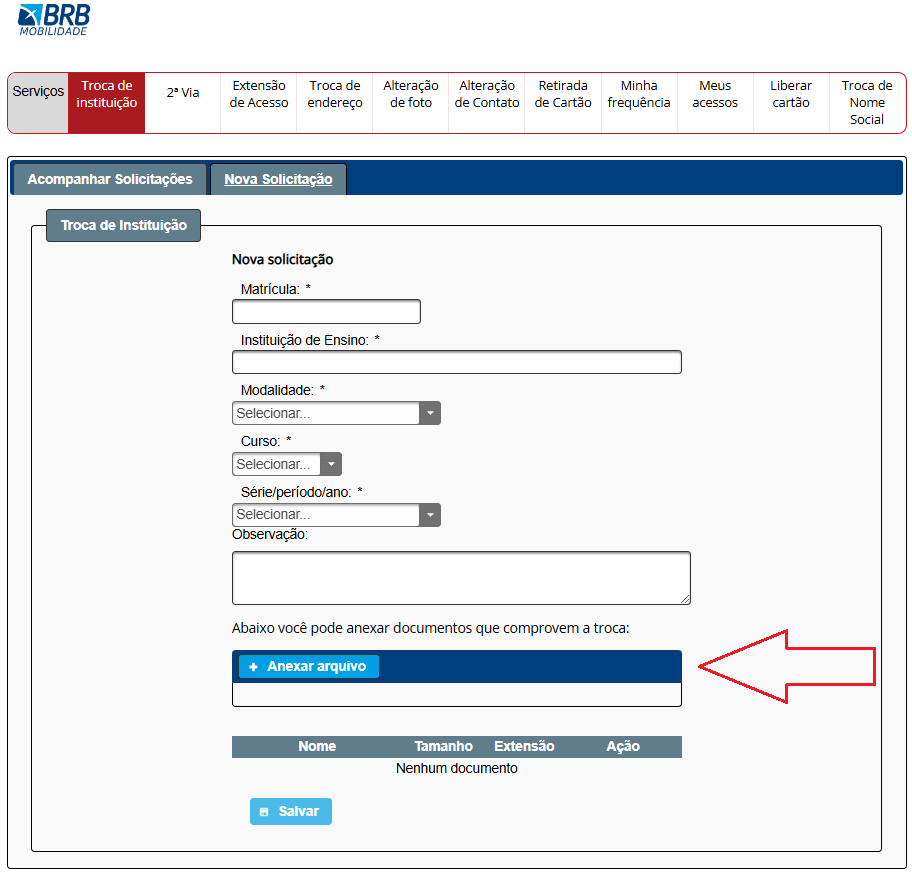

## Princípios Gerais do Projeto

## Introdução
Os princípios e diretrizes gerais de um projeto são essenciais para orientar o design de interfaces que sejam eficientes, eficazes e proporcionem uma experiência satisfatória aos usuários. No contexto do Passe Livre Estudantil, esses princípios ajudam a garantir que as plataformas digitais relacionadas ao serviço atendam às necessidades específicas de estudantes, facilitando o acesso, a usabilidade e a confiabilidade do sistema.

Esses princípios podem ser organizados em tópicos, como: atender às expectativas dos usuários, simplificar as estruturas das tarefas, equilibrar controle e liberdade do usuário, manter consistência e padronização, assegurar visibilidade e reconhecimento e apresentar conteúdo relevante e adequado. A aplicação cuidadosa desses princípios contribui para o desenvolvimento de interfaces que maximizam a utilidade do serviço e a satisfação dos usuários.

## Simplicidade nas estruturas das tarefas

### Definição

Consiste em reduzir a complexidade das ações que o usuário precisa realizar, tornando-as mais intuitivas e diretas. Isso pode ser alcançado por meio de suporte ao aprendizado, feedback visível, automação parcial e reestruturação das tarefas, sempre garantindo que o usuário mantenha o controle e compreenda o processo.

### Violação

A tela de troca de instituição no site apresenta um local para anexar documentos, mas carece de clareza sobre quais comprovantes são necessários, o que pode causar confusão ao usuário. Para melhorar a experiência, seria ideal incluir exemplos claros ou instruções detalhadas, como "Anexe comprovantes de matrícula ou declaração da nova instituição." Isso simplificaria a tarefa, alinhando-se aos princípios de usabilidade e comunicação efetiva com o público.

Figura 1 - Tela de envio de documentos para comprovar a troca de instituição no processo de atualização cadastral.

Fonte Passe Livre Estudantil

## Equilíbrio entre controle e liberdade do usuário

### Definição

Refere-se a projetar sistemas que permitam ao usuário manter o controle, explorando e corrigindo erros com flexibilidade, mas com restrições suficientes para evitar confusão ou excesso de opções. Isso inclui oferecer "saídas de emergência", permitir ações reversíveis, usar confirmações moderadamente para operações críticas e fornecer valores padrão úteis, garantindo uma interação intuitiva e segura.

### Violação

O erro exibido no site do Passe Livre Estudantil, redirecionando o usuário para uma página sem solução funcional, como mostrado na imagem, é um exemplo de má gestão de erros e falta de equilíbrio entre controle e liberdade do usuário. Além de não explicar a causa do problema de forma compreensível, o botão "Go Back" não funciona, deixando o usuário sem opções para prosseguir. Para melhorar, o sistema deveria:

- Fornecer uma explicação clara e acessível sobre o erro.
- Disponibilizar um botão funcional para retornar ou uma alternativa de navegação.
  
Figura 2 - Erro no site do Passe Livre Estudantil, redirecionando o usuário para uma página sem solução funcional

Fonte Passe Livre Estudantil

A página de alteração de foto apresenta um problema claro de falta de controle e feedback ao usuário. Não permitir que o usuário visualize a foto enviada ou altere a imagem antes de salvar cria incerteza e dificulta a correção de erros. Além disso, manter a opção de anexar outra foto sem clareza sobre o comportamento (substituir ou adicionar) torna o processo confuso e pouco intuitivo.

Para melhorar:

- Adicionar uma pré-visualização da foto enviada para confirmar se está correta.
- Incluir opções claras de substituir ou remover a foto enviada.
- Exibir mensagens de feedback indicando se a nova foto substituiu a anterior, reduzindo a ambiguidade e alinhando-se ao princípio de controle do usuário.

Figura 3 - Tela de alteração de foto no sistema do Passe Livre Estudantil

Fonte Passe Livre Estudantil

## Promovendo a Eficiência do Usuário

### Definição

É o princípio de design que prioriza economizar tempo e esforço do usuário, evitando interrupções desnecessárias, protegendo seu trabalho e oferecendo atalhos, valores padrão e personalização. O sistema deve ser sensível ao contexto do usuário, permitindo continuidade no fluxo de trabalho e garantindo uma experiência fluida e produtiva.

### Violação

No site do Passe Livre Estudantil, trocar de página faz com que todos os dados preenchidos e documentos enviados sejam perdidos, como na página de troca de instituição. Isso força o usuário a refazer todo o processo, causando frustração. O sistema deveria salvar o progresso automaticamente ou manter os dados enquanto o usuário navega, garantindo uma experiência mais eficiente e sem retrabalho.

Figura 4 - Tela de troca de instituição

Fonte Passe Livre Estudantil

## Visibilidade e Reconhecimento

### Definição

É um princípio de design de interfaces que busca tornar ações, opções e estados do sistema claros e intuitivos, reduzindo o esforço cognitivo do usuário. Ele garante que as ações sejam visíveis, o feedback seja imediato e adequado, o estado do sistema seja facilmente compreendido, e a navegação seja orientada, minimizando a sobrecarga de memória e promovendo uma experiência fluida e eficiente.

### Violação

No site, o feedback atual ao enviar uma foto para alteração é uma mensagem temporária que desaparece rapidamente, o que pode gerar incerteza ao usuário. Um feedback mais eficaz seria manter essa confirmação fixa na tela, mostrando que o arquivo foi recebido e exibindo uma pré-visualização da imagem enviada. Isso garantiria maior clareza e confiança no processo, reduzindo dúvidas sobre o sucesso da ação.

Figura 5 - Tela de alteração de foto

Fonte Passe Livre Estudantil

## Conteúdo relevante e expressão adequada

### Definição

É o princípio de design que garante que informações e elementos em interfaces sejam claros, relevantes e acessíveis. Ele enfatiza a simplicidade, evitando excessos, o uso de linguagem intuitiva e legibilidade adequada. Além disso, considera acessibilidade visual, como contraste e dicas secundárias, e utiliza princípios de design visual para organizar e destacar informações importantes, promovendo uma experiência eficiente e agradável.

### Violação

O uso de termos como "login" e "FAQ" pode criar barreiras de entendimento para usuários que não estão familiarizados com esses jargões técnicos. "Login" pode ser substituído por "Entrar" ou "Acessar sua conta", e "FAQ" por "Dúvidas Frequentes" ou "Ajuda", tornando a linguagem mais clara e acessível ao público brasileiro, especialmente para estudantes, alinhando-se às suas expectativas e promovendo uma navegação mais intuitiva.

Figura 6 - Tela de acessar sua conta

Fonte Passe Livre Estudantil

O uso de termos como "EM_ANALISE" e "PENDENTE_TROCA_INST_RETORNO" no histórico do Passe Livre pode causar confusão, pois são expressões técnicas que não são intuitivas para a maioria dos usuários. Essas nomenclaturas deveriam ser substituídas por frases mais claras, como "Em análise" ou "Pendente de troca institucional", que traduzem o status de forma acessível, promovendo melhor compreensão e alinhamento com a linguagem do público-alvo.

Figura 7 - Tela de historico

Fonte Passe Livre Estudantil

## Bibliografia

- **Slide do professor "Princípios e Diretrizes para o Design de IHC"**  
  Disponível em: [https://aprender3.unb.br/pluginfile.php/2972722/mod_resource/content/2/Apresenta%C3%A7%C3%A3o%20cap08%20Livro%20Simone.pdf](https://aprender3.unb.br/pluginfile.php/2972722/mod_resource/content/2/Apresenta%C3%A7%C3%A3o%20cap08%20Livro%20Simone.pdf)  

- **BARBOSA, S. D. J.; SILVA, B. S.**  
  *Interação Humano-Computador.* Rio de Janeiro: Elsevier, 2011. Capítulo 10.  
  Disponível em: [https://aprender3.unb.br/pluginfile.php/2972723/mod_resource/content/4/ihc-ux%20Cap.%2010.pdf](https://aprender3.unb.br/pluginfile.php/2972723/mod_resource/content/4/ihc-ux%20Cap.%2010.pdf)  

- **Site Passe Livre Estudantil**  
  Disponível em: [https://mobilidade.brb.com.br/passelivre/estudante/login.xhtml](https://mobilidade.brb.com.br/passelivre/estudante/login.xhtml)  

## Histórico de Versão

|Data|Data Prevista de Revisão|Versão|Descrição|Autor|Revisor|
| :----------: |:-----------:| :------: | :-----------: | :---------: |:---------: |
|30/11/2024| 01/12/2024 |1.0|Criação da pagina Princípios Gerais do Projeto|Breno Lucena| Breno Fernandes |
|01/11/2024| 02/12/2024 |1.1| Correções feitas na pagina |Breno Fernandes| Breno Lucena |

