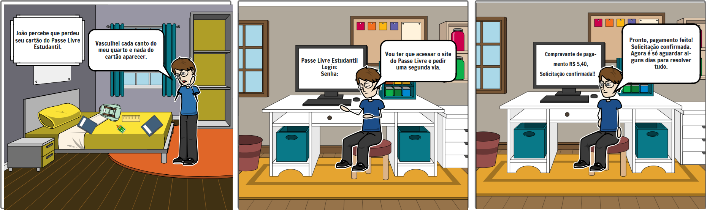

# Storyboards

## Introdução

O storyboard é um exemplo de protótipo de baixa fidelidade, muito útil devido sua simplicidade, baixo custo e rápida produção. Isso significa que podem ser rapidamente alterados. São geralmente utilizados em conjunto com cenários. 1 Ao utilizar storyboards em conjunto com cenários ou roteiros, é possível visualizar e planejar a sequência de eventos, a composição das cenas, a posição dos personagens, a movimentação da câmera e outros elementos visuais importantes. Isso ajuda a identificar possíveis problemas narrativos, ajustar a dinâmica da história e prever como ela será apresentada ao público. O storyboard consiste em uma série de ilustrações sequenciais que representam os principais momentos, ações e composições visuais de uma cena ou de todo o enredo. Cada quadro do storyboard retrata uma cena específica, acompanhada por uma descrição escrita ou diálogos relacionados. No caso de um sistema baseado em GUI. Esse modelo de artefato deve conter os seguintes elementos:

- As pessoas envolvidas;
- Ambiente/contexto;
- Tarefas;
- Passos envolvidos;
- A motivação para usar a sistema;
- O que as pessoas precisam fazer para completar a tarefa;
- A satisfação da pessoa ao completar a tarefa, no final do storyboard.
- Os protótipos foram desenvolvidos com base nas tarefas definidas nos cenários.

## Tarefa 2: Solicitação de segunda via de cartão

Na figura 1, apresenta-se um storyboard no qual o usuário percebe a perda do cartão, acessa o site, preenche o formulário, realiza o pagamento da taxa e finaliza a solicitação, aguardando o prazo informado.

Figura 1 - Storyboard solicitação 2ª via

Fonte: Breno Fernandes (2024)

<!-- ## Referências Bibliográficas
Usar apenas se houver alguma referência bibliográfica
<a id="REF1" href="#anchor_1">1. </a>Barbosa, S. D. J.; Silva, B. S. da; Silveira, M. S.; Gasparini, I.; Darin, T.; Barbosa, G. D. J. (2021) Interação Humano-Computador e Experiência do usuário. Autopublicação. -->

## Bibliografia

<!-- livro utilizado pelo professor na disciplina. -->
<!-- > BARBOSA, S. D. J.; SILVA, B. S. Interação Humano-Computador. Rio de Janeiro: Elsevier, 2011. -->

## Histórico de Versão

|    Data    | Data Prevista de Revisão | Versão |     Descrição     |                   Autor                    | Revisor |
| :--------: | :----------------------: | :----: | :---------------: | :----------------------------------------: | :-----: |
| 06/12/2024 |        07/12/2024        |  1.0   | Criação da página | [Mateus Vieira](https://github.com/matix0) |     Breno Fernandes    |
| 06/12/2024 |        08/12/2024        |  1.1   | Adicionando Storyboard 2ª via | [Breno Fernandes](https://github.com/brenofrds) |     Breno Lucena    |
