#  Planejamento do relato dos resultados da avaliação do Protótipo de Papel.

# Introdução

Este artefato tem o objetivo de documentar o planejamento para o relato dos resultados obtidos pela avaliação do protótipo de papel. Nele serão abordados os tópicos necessários para a construção de tal relato.

# Metodologia

Tendo como base os tópicos relatados, além da avaliação de intersujeito descrita por Barbosa e Silva, e adaptando-os para o documento a ser desenvolvido pela equipe, os seguintes tópicos serão incluídos:

- Objetivo e escopo da avaliação
- Método de avaliação
- Seleção dos participantes
- Problemas e dificuldades encontradas
- Sugestões de melhoria
- Feedback dos usuários
- Análise e interpretação dos usuários
- Sumário dos principais resultados
- Planejamento de reprojeto

# Tópicos

A documentação do relato da avaliação deverá conter os tópicos citados abaixo:

## Objetivo e Escopo da Avaliação

Nesta etapa, o redator do documento deverá explicar a razão pela qual a avaliação está sendo realizada e descrever o objetivo que o grupo pretende alcançar com o protótipo de papel. Isso envolve justificar a importância da avaliação, esclarecer as expectativas e as metas estabelecidas, e fornecer uma visão geral do propósito e do contexto da avaliação. No caso, os objetivos são:

- Verificar a conformidade com um padrão;
- Comparar ideias e alternativas de design;
- Identificar problemas na interação e interface.

Além disso, deve-se responder às seguintes perguntas por meio da análise da avaliação, a fim de verificar se os objetivos foram alcançados:

1. Com o protótipo de papel foi possível explorar conceitos de design?
2. Foi observada alguma sugestão de melhoria para o protótipo proposto?
3. Foi possível identificar problemas de usabilidade preliminares?
4. Foi possível identificar ideias principais de design?

## Método de Avaliação

O método utilizado para a avaliação foi baseado na **observação e entrevista dos usuários**. Essa metodologia foi escolhida por ser eficiente na coleta de dados qualitativos, permitindo analisar as interações dos usuários com o protótipo e obter suas percepções em tempo real. A abordagem seguiu o planejamento definido previamente, garantindo consistência no processo de avaliação.

Durante a avaliação, os participantes seram apresentados a protótipos de papel e realizarão tarefas enquanto verbalizavam suas ações e pensamentos. As sessões seram filmadas para análise posterior. O ambiente de avaliação foi configurado de forma simples, vamos utilizar um celular para gravação, caneta e papel para anotações, além de protótipos físicos representando as telas.

Abaixo, seguem as descrições das telas do protótipo de papel utilizadas para avaliar as funcionalidades de **Cartão Virtual** e **Solicitação de Segunda Via**.

### Cartão Virtual

#### Tela 1: Tela de Login

Esta é a tela inicial onde o usuário insere suas credenciais (cpf e senha) para acessar o sistema.

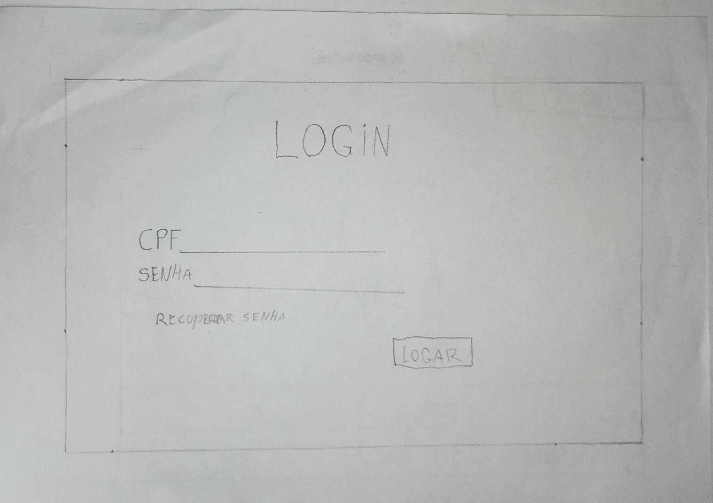
Figura 1: Tela de Login 

#### Tela 2: Tela Inicial

Após o login, o usuário visualiza o menu principal, onde pode acessar a funcionalidade "Acesso e Cartão".

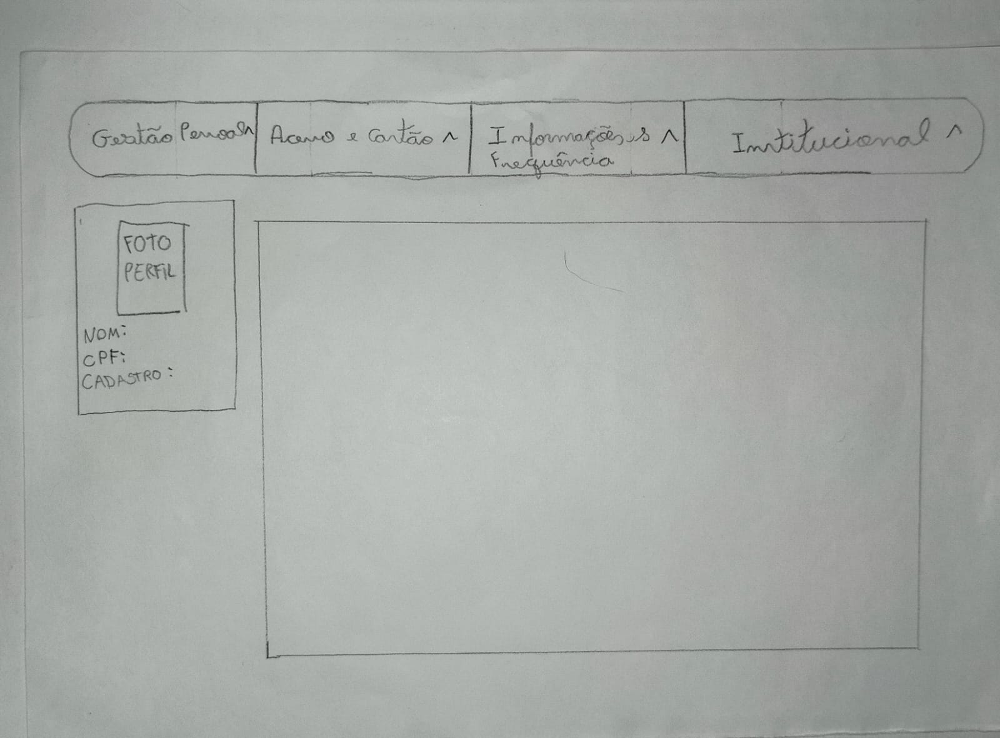
Figura 2: Tela Inicial 

#### Tela 3: Tela Inicial com Dropdown

A tela exibe um menu dropdown com opções adicionais, incluindo "Cartão Virtual".

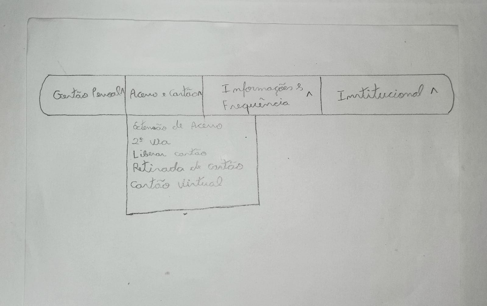
Figura 3: Tela Inicial botão dropdown 

#### Tela 4: Descrição do Cartão Virtual

Esta tela apresenta informações explicativas sobre o cartão virtual e seus benefícios.

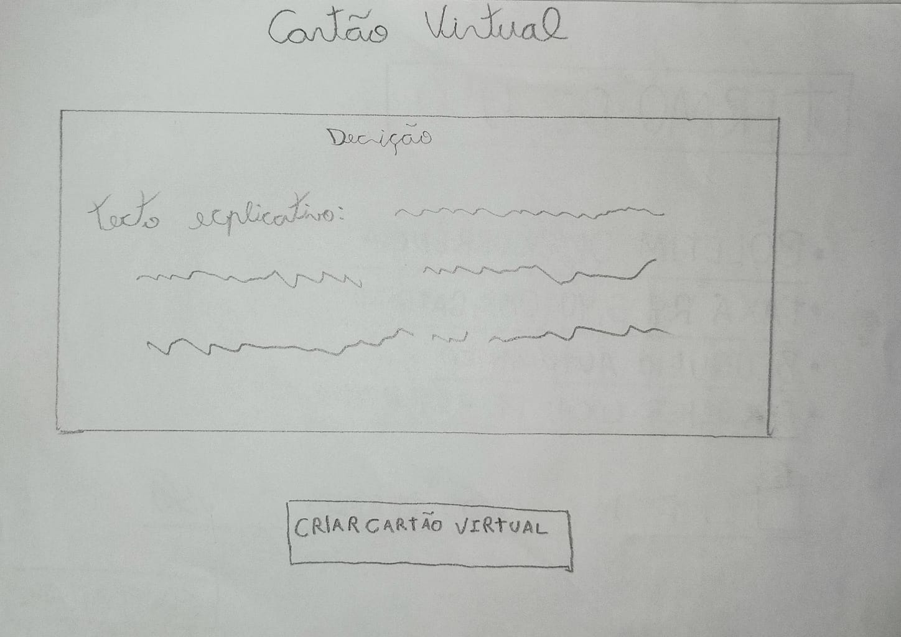
Figura 4: Tela com descrição do que é um cartão virtual 

#### Tela 5: Confirmação de Dados  

O usuário insere dados como nome, CPF e número do cartão físico.

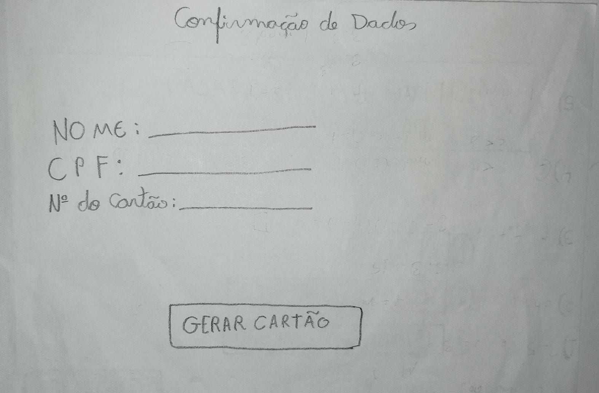
Figura 5: Tela de confirmação de dados 

#### Tela 6: Cartão Virtual Gerado

A tela exibe o QR Code e o código alfanumérico para integração com carteiras digitais.

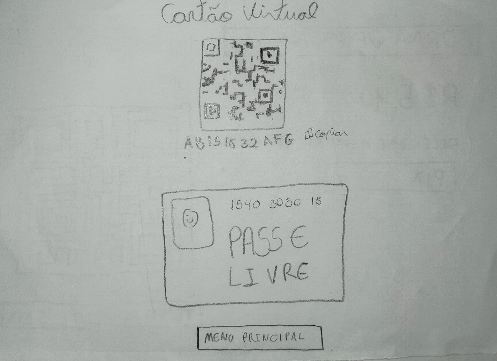
Figura 6: Tela que exibe QR-code para integração com carteira digital 

### Segunda Via

#### Tela 1: Tela de Login

Esta é a tela inicial onde o usuário insere suas credenciais (cpf e senha) para acessar o sistema.

Figura 7: Tela de Login 

#### Tela 2: Tela Inicial

A tela principal, onde o usuário encontra as opções de navegação, incluindo "Acesso e cartão".

Figura 8: Tela Inicial 

#### Tela 3: Tela Inicial com Dropdown

A tela exibe um menu dropdown com opções adicionais, incluindo "Segunda via".

Figura 9: Tela Inicial botão dropdown 

#### Tela 4: Escolha do Motivo 

O usuário seleciona o motivo para a solicitação, como "Roubo ou Furto".

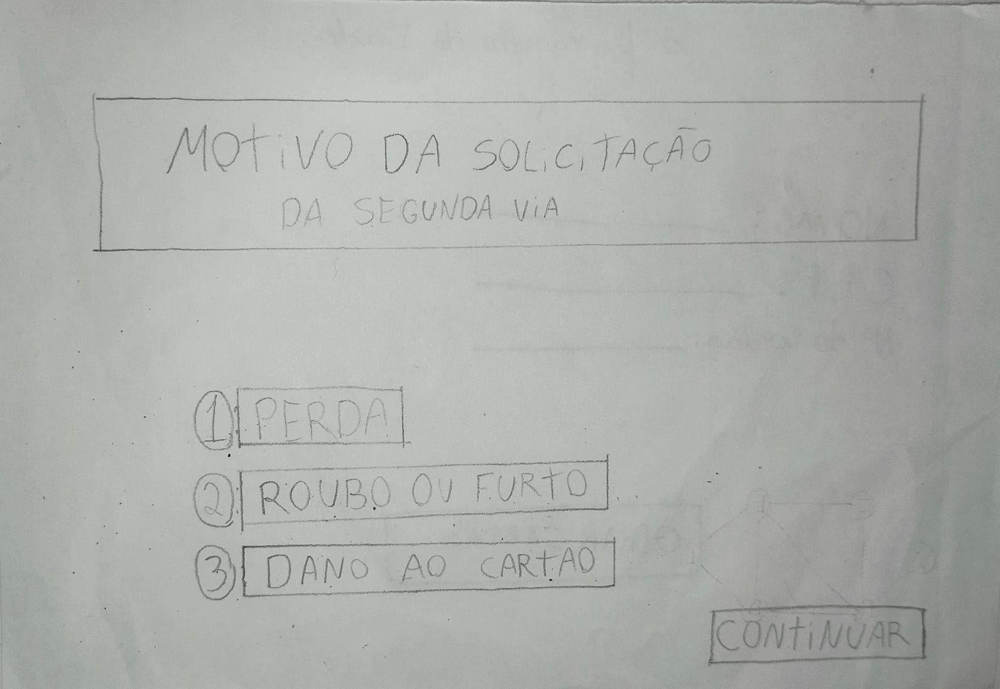
Figura 10: Tela para escolher o motivo da solicitação 

#### Tela 5: Termo de Uso

A tela apresenta os termos de uso que o usuário deve aceitar antes de prosseguir.

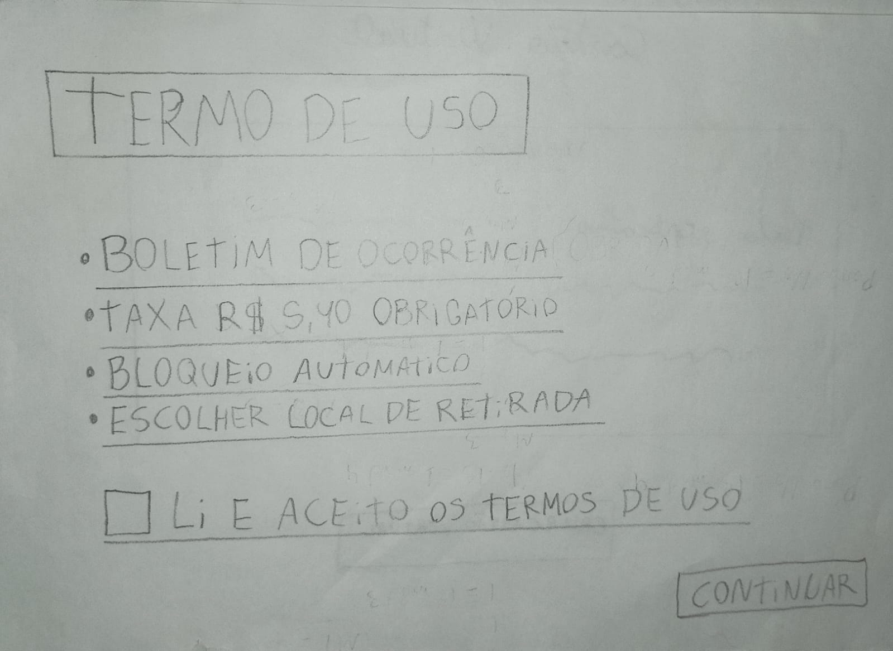
Figura 11: Tela com o termo de uso 

#### Tela 6: Envio de Boletim de Ocorrência

O usuário pode anexar um boletim de ocorrência para completar a solicitação.

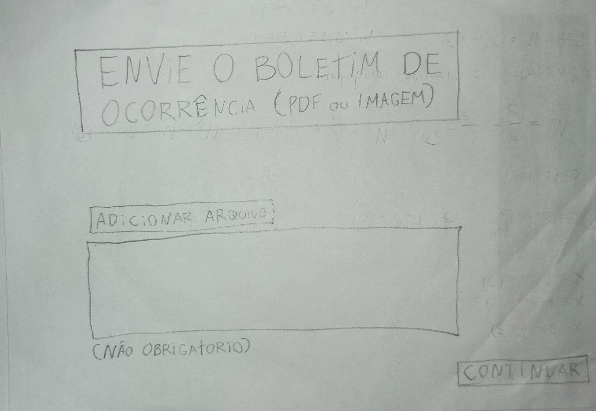
Figura 12: Tela para enviar o boletim de ocorrencia 

#### Tela 7: Seleção do Local de Retirada

O usuário escolhe o local mais conveniente para retirar o cartão físico.

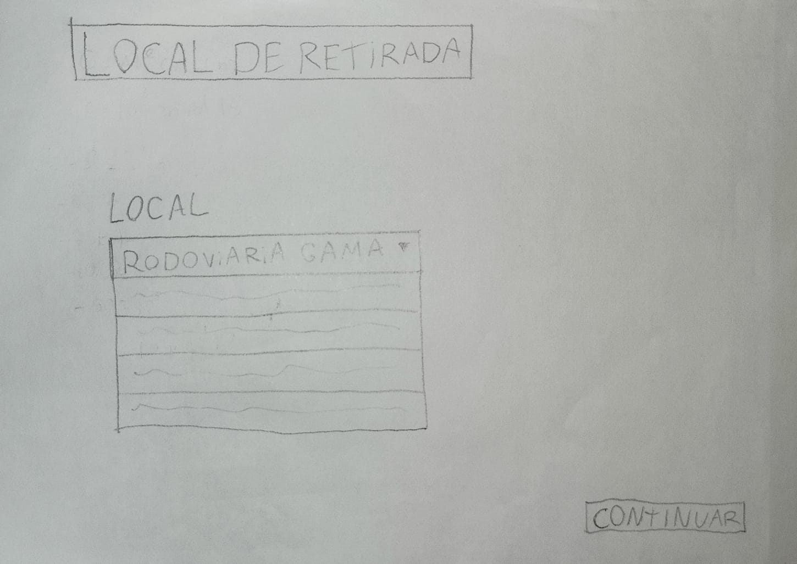
Figura 13: Tela para selecionar o local de retirada 

#### Tela 8: Forma de Pagamento 

O usuário seleciona a forma de pagamento, como Pix, para completar a solicitação.

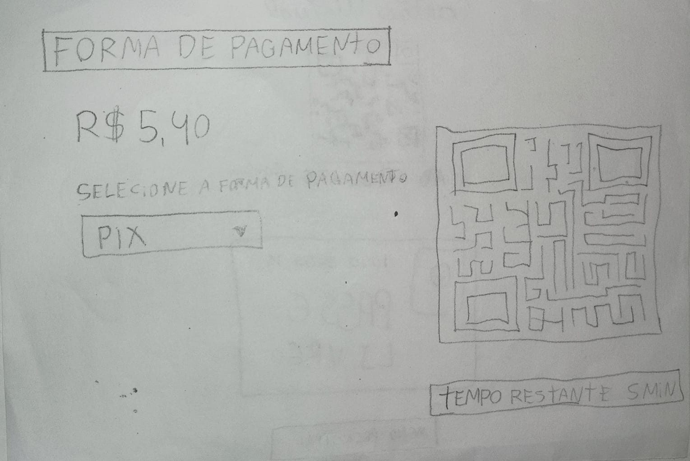
Figura 14: Tela para selecionar a forma de pagamento 

#### Tela 9: Sucesso e Status da Solicitação

A tela final confirma que a solicitação foi realizada com sucesso e informa o status como "Em Análise".

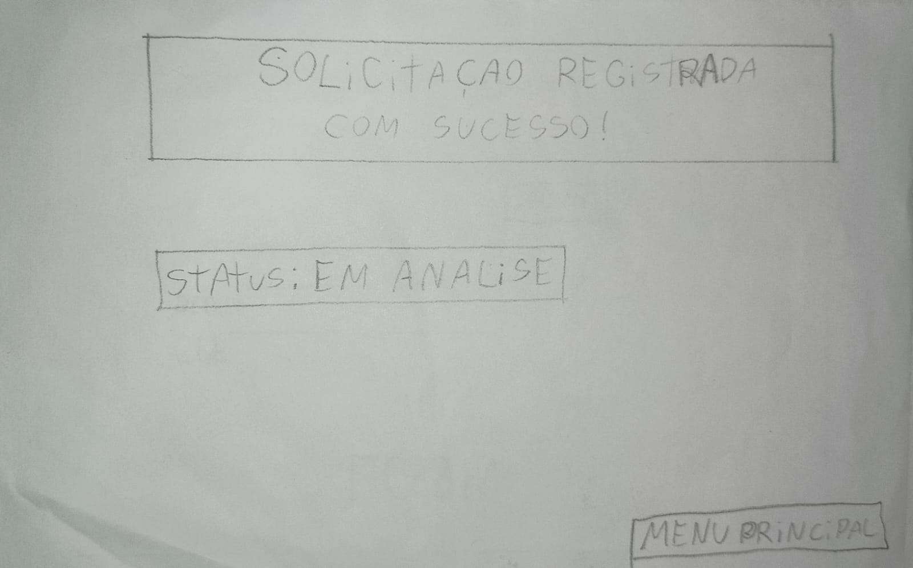
Figura 15: Tela de sucesso e status da solicitação

*A Tabela 1 apresenta o cronograma planejado.*

**Tabela 1** - Cronograma Planejado.

| Entrevistadores | Usuário | Data       | Início-Fim  | Local              |
| ------------- | ------- | ---------- | ----------- | ------------------ |
| [Breno Lucena](https://github.com/BrenoLUCO)  | Geovanna ALmeida| 23/01/2025| 16:00-18:00|Casa do Breno Fernandes|
| [Breno Fernandes](https://github.com/Brenofrds)|Lívia Sena| 23/01/2025| 16:00-18:00|Casa do Breno Fernandes|

# Seleção dos Participantes

Após o preenchimento do cronograma, será necessário fornecer uma justificativa da seleção do entrevistado, verificando se ele se encaixa no perfil de usuário definido no projeto. É importante que os entrevistados possuam semelhanças com o nosso elenco de personas, pois são o público-alvo que se deseja atingir, permitindo captar os desejos dos usuários do Passe livre estudantil. No caso, os participantes escolhidos e explicitados na Tabela 1 estão de acordo com o perfil de usuário.

# Problemas e Dificuldades Encontradas

Nesta seção do documento, o entrevistador deve detalhadamente listar os problemas e dificuldades específicas que o usuário encontrou durante a sessão de entrevista. Isso envolve registrar de forma clara e objetiva cada obstáculo, erro, falha ou desafio enfrentado pelo usuário ao interagir com o sistema ou produto avaliado.

# Sugestões de Melhoria

É importante que o entrevistador documente de forma completa as sugestões e melhorias com base nos problemas identificados durante a avaliação. O registro deve ser claro e objetivo, descrevendo o contexto, a ação do usuário, o resultado esperado e o resultado observado. Além disso, o entrevistador deve propor soluções ou sugestões para corrigir os problemas identificados, oferecendo ideias para ajustes de design, melhorias na interface do usuário ou alterações nas funcionalidades.

# Feedback dos Usuários

É essencial que o entrevistador capte o feedback dos usuários que foram entrevistados durante a avaliação de tarefas. Isso envolve ouvir atentamente as opiniões, sugestões e comentários expressos pelos usuários durante a interação com o sistema ou produto avaliado. O entrevistador deve registrar de forma completa e precisa o feedback fornecido pelos usuários, levando em consideração suas percepções, experiências e necessidades. Essas informações são valiosas para compreender as expectativas dos usuários, identificar pontos fortes e fracos do sistema e obter insights sobre possíveis melhorias.

# Análise e Interpretação dos Resultados

O entrevistador deve realizar uma análise e interpretação dos resultados obtidos a partir da avaliação de tarefas. Isso envolve examinar cuidadosamente os dados coletados durante a avaliação, identificar padrões, tendências e insights relevantes, e extrair conclusões significativas a partir dessas informações. O entrevistador deve contextualizar os resultados dentro do objetivo da avaliação, considerando o impacto dos problemas identificados na usabilidade, na experiência do usuário e nos objetivos estabelecidos. Além disso, deve-se responder às perguntas levantadas inicialmente.

# Sumário dos Principais Resultados

Serão apresentados de forma resumida e objetiva os dados obtidos com a avaliação de cada tarefa, contendo uma descrição breve de se os participantes conseguiram realizá-la com êxito ou não. A apresentação dos dados pode ser feita por meio de uma tabela ou texto. No entanto, deve-se disponibilizar a gravação da seguinte forma:

# Planejamento de Reprojeto

Por fim, como o propósito da referida atividade está quase sempre relacionado à validação feita com o auxílio de um usuário real, as mudanças sugeridas e as outras vicissitudes encontradas ao se realizar a análise do artefato especificado devem ser consideradas para a realização de um reprojeto. No entanto, tal reprojeto deve manter a base do projeto original e realizar somente as alterações necessárias de fato.

Logo, a Tabela 2 explicita um cronograma de reprojeto, que seria feito 1 dia após a entrevista. O horário será algo flexível e não deve ser seguido estritamente.

| Executadores do projeto|Horário de início| Horário de Fim| Data |
| -----------------------| ----------------|---------------|----- |
|Breno Lucena & Breno Fernandes| 16:00     |   18:00       |29/01/2025 |

## Bibliografia

Design de Interação: Além da Interação Humano-Computador. Capítulo 8.2.3 - Prototipação de baixa fidelidade.

Design Thinking: Inovação em Negócios. Protótipo de Papel (p. 126).

## Histórico de Versões

|    Data    | Data Prevista de Revisão | Versão | Descrição | Autor | Revisor |
| :--------: | :----------------------: | :----: | :-------: | :---: | :-----: |
| 18/01/24   |   24/01/2025      |  1.0   |  Criação do documento.|Breno Lucena| Breno Fernandes |
