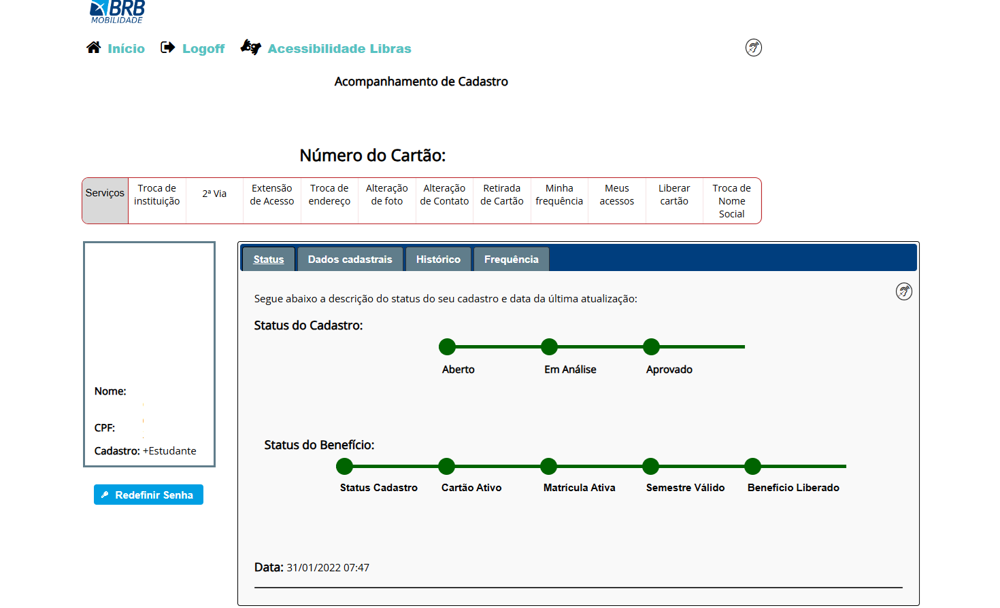
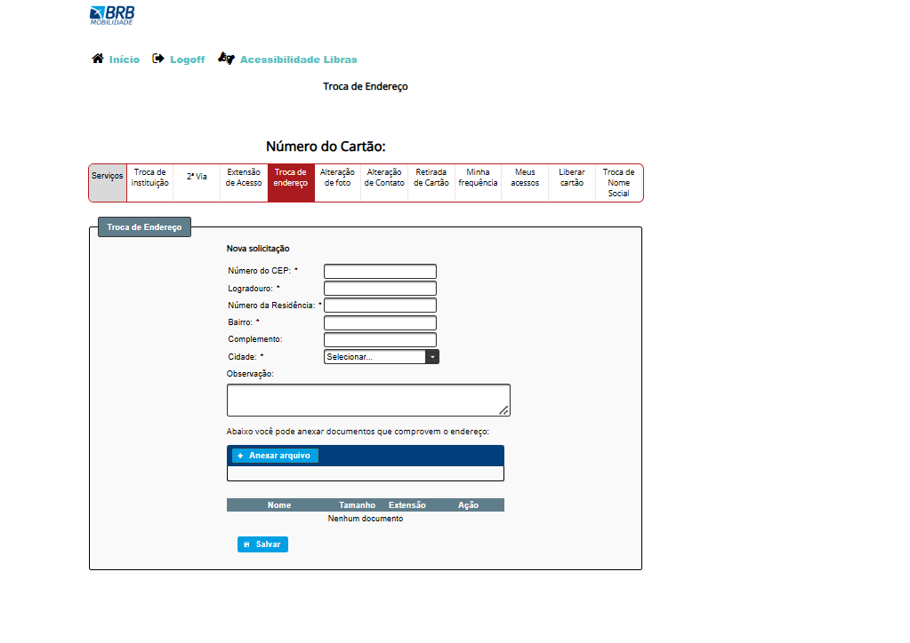
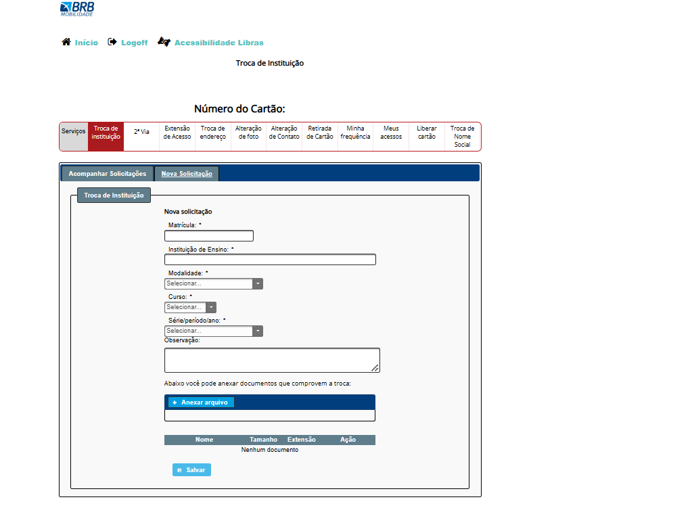
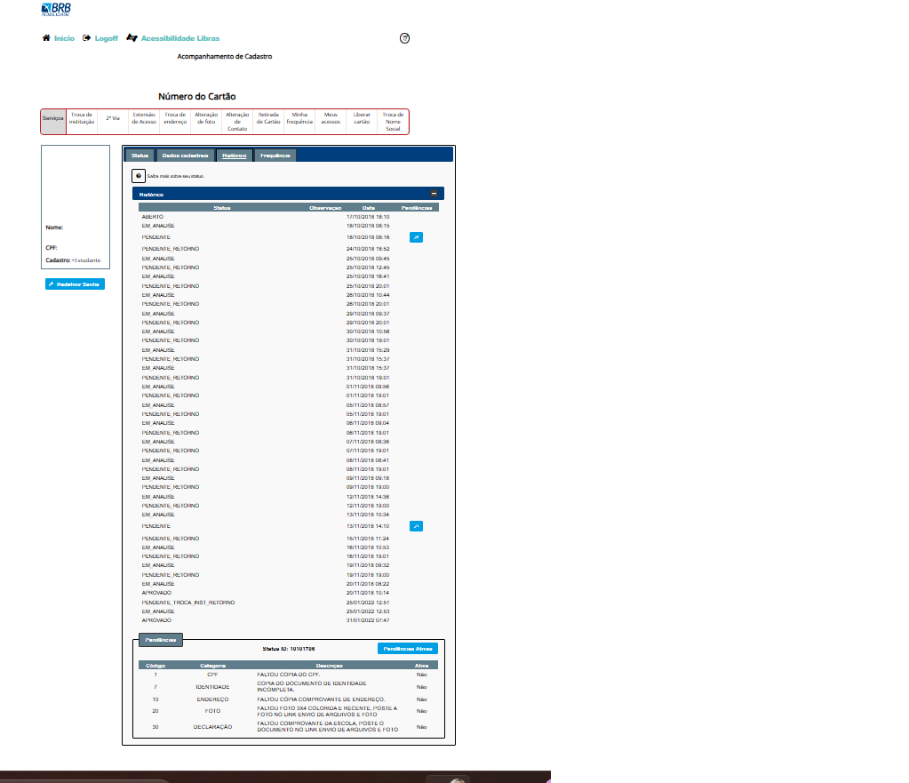

## Princípios Gerais do Projeto

## Introdução
Os princípios e diretrizes gerais de um projeto são essenciais para orientar o design de interfaces que sejam eficientes, eficazes e proporcionem uma experiência satisfatória aos usuários. No contexto do Passe Livre Estudantil, esses princípios ajudam a garantir que as plataformas digitais relacionadas ao serviço atendam às necessidades específicas de estudantes, facilitando o acesso, a usabilidade e a confiabilidade do sistema.

Esses princípios podem ser organizados em tópicos, como: atender às expectativas dos usuários, simplificar as estruturas das tarefas, equilibrar controle e liberdade do usuário, manter consistência e padronização, assegurar visibilidade e reconhecimento e apresentar conteúdo relevante e adequado. A aplicação cuidadosa desses princípios contribui para o desenvolvimento de interfaces que maximizam a utilidade do serviço e a satisfação dos usuários.

## Resumo dos Princípios no Contexto do Passe Livre Estudantil

### Correspondência com as expectativas dos usuários
A interface deve refletir as necessidades dos estudantes, considerando sua familiaridade com sistemas similares, como cadastros online ou consultas de saldo. Isso reduz confusões e facilita o uso intuitivo.

### Simplicidade nas estruturas das tarefas
As etapas para solicitação, renovação ou consulta do benefício devem ser claras e rápidas. Evitar sobrecarregar o usuário com informações desnecessárias.

### Equilíbrio entre controle e liberdade do usuário
Oferecer ao estudante controle sobre suas informações, como a possibilidade de corrigir dados ou alterar preferências, enquanto mantém liberdade para navegar e explorar opções, como consultar orientações.

### Consistência e padronização
A interface deve manter uniformidade visual e funcional em todas as páginas, com elementos como botões, cores e ícones padronizados, facilitando o reconhecimento e a navegação.

### Visibilidade e reconhecimento
Ícones intuitivos, botões claros e informações bem posicionadas ajudam os usuários a reconhecer facilmente as funcionalidades do sistema.

### Conteúdo relevante e expressão adequada
A linguagem deve ser acessível, utilizando termos familiares aos estudantes e evitando jargões técnicos. Informações como prazos e condições devem ser apresentadas de maneira objetiva e clara.

## Conclusão

É possível concluir que os princípios e diretrizes gerais de design de interfaces desempenham um papel fundamental na criação de plataformas digitais que sejam eficientes, eficazes e agradáveis para os usuários. No contexto do **Passe Livre Estudantil**, a aplicação desses princípios é especialmente relevante para garantir que os estudantes tenham uma experiência positiva ao acessar serviços essenciais, como cadastro, renovação e consulta de benefícios.

A análise realizada demonstra que, embora a adoção desses princípios possa apresentar desafios, sua aplicação consistente contribui para interfaces mais acessíveis, intuitivas e alinhadas às expectativas do público-alvo. Dessa forma, sistemas projetados com base em boas práticas de **Interação Humano-Computador (IHC)** não apenas atendem às necessidades imediatas dos usuários, mas também promovem inclusão e eficiência no acesso a direitos fundamentais, como o transporte gratuito para estudantes.

Esses aprendizados reforçam a importância de priorizar a usabilidade e a experiência do usuário em projetos voltados para serviços públicos, como o **Passe Livre Estudantil**, destacando a relevância de uma abordagem centrada no usuário para maximizar o impacto e a aceitação dessas plataformas.

# Correspondência com as expectativas dos usuários:

Figura 1: Tela de status de cadastro e benefício do sistema de Passe Livre Estudantil e tela inicial.

A interface apresentada facilita a correspondência com as expectativas dos usuários ao organizar informações e processos de forma estruturada e previsível. Na Figura 1, é possível observar como o site apresenta o progresso do "Status do Cadastro" e "Status do Benefício" em formato de linha do tempo com marcadores verdes. Essa abordagem visual reflete as ações e o estado atual de maneira clara, permitindo que o usuário entenda facilmente o que foi concluído e o que ainda está pendente.

Além disso, o menu superior com opções bem identificadas, como "Troca de endereço" e "Alteração de foto", atende às expectativas ao reunir serviços relacionados em um local centralizado, reduzindo a necessidade de navegação complexa. Essas escolhas de design ajudam a alinhar o sistema às necessidades e experiências prévias dos usuários.

# Simplicidade nas estruturas das tarefas:

Figura 2: Tela de troca de endereço.

Ao analisar a tela da Figura 2, podemos observar como o design do formulário para troca de endereço segue o princípio da simplicidade nas estruturas das tarefas. O formulário apresenta campos claramente identificados, com títulos como "Número do CEP", "Logradouro", "Número da Residência", e "Bairro", facilitando a compreensão do que precisa ser preenchido.

Além disso, a interface utiliza menus suspensos, como o campo "Cidade", que ajudam a simplificar a navegação, evitando que o usuário precise digitar dados longos ou propensos a erro. A presença de uma área para anexar documentos também está bem destacada com um botão de ação, "Anexar arquivo", claramente visível e de fácil acesso.

No entanto, poderia ser ainda mais eficiente se houvesse a redução da quantidade de informações a serem preenchidas de uma vez. Dividir o processo em etapas menores (ex.: primeiro dados pessoais, depois endereço) poderia facilitar ainda mais a interação, garantindo que o usuário não se sinta sobrecarregado.

Assim, o design segue o princípio da simplicidade ao organizar claramente as tarefas e minimizar a complexidade dos processos para o usuário.

# Equilíbrio entre controle e liberdade do usuário

Figura 3: Tela de troca de instituição.

A interface da imagem sobre a troca de instituição no passe livre estudantil apresenta alguns problemas no equilíbrio entre controle e liberdade do usuário. Embora os campos obrigatórios garantam que as informações essenciais sejam fornecidas, a rigidez nas escolhas do formulário, como menus suspensos para selecionar a modalidade e o curso, limita a liberdade do usuário para personalizar seu preenchimento. Além disso, a exigência de anexar documentos pode ser vista como uma sobrecarga, principalmente se não for claro para o usuário o motivo da solicitação. Para melhorar o equilíbrio, seria útil permitir preenchimentos mais flexíveis, fornecer explicações claras sobre os documentos necessários e reduzir a quantidade de campos obrigatórios, oferecendo mais liberdade e controle ao usuário.

# Consistência e Padronização

Figura 4: Tela de hitórico.

A interface apresentada possui problemas de consistência e padronização, como desalinhamento visual nos botões de navegação, falta de uniformidade na terminologia (ex.: "Status" e "Categoria"), estrutura não uniforme na tabela de histórico (textos cortados e ícones sem legendas), além de hierarquia visual fraca, dificultando a leitura e orientação do usuário. Para melhorar, é necessário alinhar os elementos, padronizar rótulos, adicionar legendas explicativas para ícones e reforçar a hierarquia visual com contraste, espaçamentos e organização clara.

# Visibilidade e reconhecimento

Figura 5: Tela de status de cadastro e benefício do sistema de Passe Livre Estudantil e tela inicial.

Pontos positivos:

 - O status do cadastro e do benefício é apresentado de forma visual, utilizando uma linha do tempo com marcadores claros ("Aberto", "Em Análise", "Aprovado"), facilitando o reconhecimento do progresso pelo usuário.

- Informações essenciais, como nome, CPF, tipo de cadastro e o número do cartão, estão destacadas e de fácil acesso.

- A aba ativa no menu superior ("2ª Via") está em vermelho, ajudando a identificar rapidamente o contexto da página.

Pontos negativos:

- Embora os marcadores de status sejam claros, a ausência de detalhes ou instruções adicionais para cada etapa pode dificultar o entendimento, especialmente se houver dúvidas sobre os próximos passos.

- A hierarquia visual do conteúdo é fraca, com informações importantes (como data da última atualização) apresentadas em fontes pequenas e pouco destacadas.

- A organização geral da interface pode confundir o usuário, pois o menu lateral e as abas principais competem pela atenção.

# Conteúdo relevante e expressão adequada

Figura 4: Tela de hitórico.

Observa-se que o conteúdo carece de clareza e expressão adequada. Embora informações como status, pendências e histórico sejam apresentadas, a linguagem utilizada não é totalmente acessível e pode gerar dúvidas, especialmente por conter termos técnicos ou ambíguos, como "Pendente_Troca_Rest_Horário". Além disso, a organização das informações não facilita a compreensão imediata, e detalhes importantes, como orientações sobre como resolver as pendências ou os prazos, não estão destacados de forma objetiva. Para atender ao princípio de conteúdo relevante e expressão adequada, seria necessário simplificar a linguagem, usar termos familiares ao público e apresentar informações críticas de forma mais clara e estruturada.

## Bibliografia

BARBOSA, S. D. J.; SILVA, B. S.; SILVEIRA, M. S.; GASPARINI, I.; DARIN, T.; BARBOSA, G. Interação Humano-Computador. Leanpub, 2020.(Versão Grátis disponível em: https://kupdf.net/download/simone-barbosa-and-bruno-silva-interaao-homem-computador_5989d556dc0d608f2e300d1f_pdf). Acesso em:30/11/2024.

## Histórico de Versão

|Data|Data Prevista de Revisão|Versão|Descrição|Autor|Revisor|
| :----------: |:-----------:| :------: | :-----------: | :---------: |:---------: |
|30/11/2024||1.0|Criação da pagina Princípios Gerais do Projeto|Breno Lucenas| |

