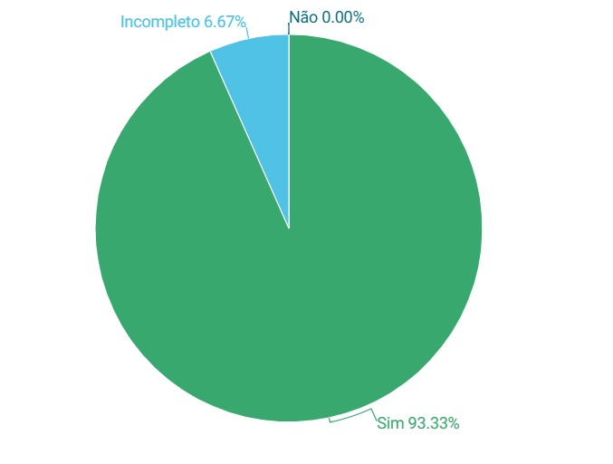

# Resultado da Verificação Geral

## Introdução

Este documento apresenta os resultados da verificação geral dos artefatos produzidos pelo **Grupo 7** na Etapa de verificação Geral. A verificação é uma etapa fundamental para garantir a qualidade dos artefatos, assegurando que eles atendam aos padrões estabelecidos e cumpram os requisitos especificados.

A verificação foi realizada com base no planejamento previamente elaborado, utilizando checklists para avaliar cada artefato em relação a critérios como padronização, completude, conformidade com normas e requisitos de usabilidade.

---

## Metodologia

A metodologia empregada nesta verificação foi a **inspeção**, um método de análise sistemática no qual revisores independentes examinam os artefatos para identificar erros, inconsistências e oportunidades de melhoria.

A inspeção foi conduzida pelos seguintes membros do grupo:

- **Breno Lucena**
- **Breno Fernandes**

Cada artefato foi analisado individualmente, seguindo um checklist previamente definido. Os itens avaliados incluem presença de introdução, referências bibliográficas, histórico de versões, uso correto de tabelas e imagens, e conformidade com normas técnicas.

Ao final da verificação, os resultados foram consolidados e representados graficamente para facilitar a interpretação dos dados e auxiliar no planejamento de ajustes e correções.

---

## Resultados da Verificação

A seguir, são apresentadas as tabelas contendo os resultados da verificação de cada artefato. Após as tabelas, gráficos ilustram a quantidade de questões marcadas como **Sim**, **Não** e **Incompleto**, permitindo uma análise visual das conformidades e deficiências identificadas.

### Cronograma 

**Tabela 1** - Checklist de Verificação.

|   ID   | Descrição                                                                                     | Avaliação  | Observações          |
|:------:|-----------------------------------------------------------------------------------------------|:----------:|-----------------------|
| **Padronização** |                                                                                     |            |                       |
|   1    | O artefato possui introdução?                                                                 |     Sim       |                       |
|   2    | O artefato possui uma bibliografia/referência bibliográfica?                                  |         Sim   |                       |
|   3    | O artefato possui um histórico de versões com o ID, descrição das versões, data, autores e revisores? |      Sim      |                       |
|   4    | Todas as tabelas e imagens são chamadas no texto, possuem legendas e fontes?                  |    Sim        |                       |
|   5    | Todos os textos estão na norma padrão?                                                        |     Sim       |                       |

_Fonte: Breno Fernandes e Breno Lucena 2025.

#### Grafico

<b>Figura  1</b> - Grafico Cronograma.

<b>Fonte:</b> Breno Fernandes e Breno Lucena

### Design

**Tabela 2** - Checklist de Verificação.

|   ID   | Descrição                                                                                     | Avaliação  | Observações          |
|:------:|-----------------------------------------------------------------------------------------------|:----------:|-----------------------|
| **Padronização** |                                                                                     |            |                       |
|   1    | O artefato possui introdução?                                                                 |     Sim       |                       |
|   2    | O artefato possui uma bibliografia/referência bibliográfica?                                  |         Sim   |                       |
|   3    | O artefato possui um histórico de versões com o ID, descrição das versões, data, autores e revisores? |      Sim      |                       |
|   4    | Todas as tabelas e imagens são chamadas no texto, possuem legendas e fontes?                  |    Sim        |                       |
|   5    | Todos os textos estão na norma padrão?                                                        |     Sim       |                       |

_Fonte: Breno Fernandes e Breno Lucena 2025.

#### Grafico

<b>Figura  2</b> - Grafico Design.

<b>Fonte:</b> Breno Fernandes e Breno Lucena

### Ferramentas

**Tabela 3** - Checklist de Verificação.

|   ID   | Descrição                                                                                     | Avaliação  | Observações          |
|:------:|-----------------------------------------------------------------------------------------------|:----------:|-----------------------|
| **Padronização** |                                                                                     |            |                       |
|   1    | O artefato possui introdução?                                                                 |     Sim       |                       |
|   2    | O artefato possui uma bibliografia/referência bibliográfica?                                  |         Sim   |                       |
|   3    | O artefato possui um histórico de versões com o ID, descrição das versões, data, autores e revisores? |      Sim      |                       |
|   4    | Todas as tabelas e imagens são chamadas no texto, possuem legendas e fontes?                  |    Sim        |                       |
|   5    | Todos os textos estão na norma padrão?                                                        |     Sim       |                       |

_Fonte: Breno Fernandes e Breno Lucena 2025.

#### Grafico

<b>Figura  3</b> - Grafico Ferramentas.

<b>Fonte:</b> Breno Fernandes e Breno Lucena

### Heatmap

**Tabela 4** - Checklist de Verificação.

|   ID   | Descrição                                                                                     | Avaliação  | Observações          |
|:------:|-----------------------------------------------------------------------------------------------|:----------:|-----------------------|
| **Padronização** |                                                                                     |            |                       |
|   1    | O artefato possui introdução?                                                                 |     Sim       |                       |
|   2    | O artefato possui uma bibliografia/referência bibliográfica?                                  |         Sim   |                       |
|   3    | O artefato possui um histórico de versões com o ID, descrição das versões, data, autores e revisores? |      Sim      |                       |
|   4    | Todas as tabelas e imagens são chamadas no texto, possuem legendas e fontes?                  |    Sim        |                       |
|   5    | Todos os textos estão na norma padrão?                                                        |     Sim       |                       |

_Fonte: Breno Fernandes e Breno Lucena 2025.

#### Grafico

<b>Figura  4</b> - Grafico Heatmap.

<b>Fonte:</b> Breno Fernandes e Breno Lucena

### metodologia

**Tabela 5** - Checklist de Verificação.

|   ID   | Descrição                                                                                     | Avaliação  | Observações          |
|:------:|-----------------------------------------------------------------------------------------------|:----------:|-----------------------|
| **Padronização** |                                                                                     |            |                       |
|   1    | O artefato possui introdução?                                                                 |     Sim       |                       |
|   2    | O artefato possui uma bibliografia/referência bibliográfica?                                  |         Sim   |                       |
|   3    | O artefato possui um histórico de versões com o ID, descrição das versões, data, autores e revisores? |      Sim      |                       |
|   4    | Todas as tabelas e imagens são chamadas no texto, possuem legendas e fontes?                  |    Sim        |                       |
|   5    | Todos os textos estão na norma padrão?                                                        |     Sim       |                       |

_Fonte: Breno Fernandes e Breno Lucena 2025.

#### Grafico

<b>Figura  5</b> - Grafico metodologia.

<b>Fonte:</b> Breno Fernandes e Breno Lucena

### Sites avaliados

**Tabela 6** - Checklist de Verificação.

|   ID   | Descrição                                                                                     | Avaliação  | Observações          |
|:------:|-----------------------------------------------------------------------------------------------|:----------:|-----------------------|
| **Padronização** |                                                                                     |            |                       |
|   1    | O artefato possui introdução?                                                                 |     Sim       |                       |
|   2    | O artefato possui uma bibliografia/referência bibliográfica?                                  |         Sim   |                       |
|   3    | O artefato possui um histórico de versões com o ID, descrição das versões, data, autores e revisores? |      Sim      |                       |
|   4    | Todas as tabelas e imagens são chamadas no texto, possuem legendas e fontes?                  |    Sim        |                       |
|   5    | Todos os textos estão na norma padrão?                                                        |     Sim       |                       |

_Fonte: Breno Fernandes e Breno Lucena 2025.

#### Grafico

<b>Figura  6</b> - Grafico Sites avaliados.

<b>Fonte:</b> Breno Fernandes e Breno Lucena

### Site escolhido

**Tabela 7** - Checklist de Verificação.

|   ID   | Descrição                                                                                     | Avaliação  | Observações          |
|:------:|-----------------------------------------------------------------------------------------------|:----------:|-----------------------|
| **Padronização** |                                                                                     |            |                       |
|   1    | O artefato possui introdução?                                                                 |     Sim       |                       |
|   2    | O artefato possui uma bibliografia/referência bibliográfica?                                  |         Sim   |                       |
|   3    | O artefato possui um histórico de versões com o ID, descrição das versões, data, autores e revisores? |      Sim      |                       |
|   4    | Todas as tabelas e imagens são chamadas no texto, possuem legendas e fontes?                  |    Sim        |                       |
|   5    | Todos os textos estão na norma padrão?                                                        |     Sim       |                       |

_Fonte: Breno Fernandes e Breno Lucena 2025.

#### Grafico

<b>Figura  7</b> - Grafico Site escolhido.

<b>Fonte:</b> Breno Fernandes e Breno Lucena

### Aspectos Eticos

**Tabela 8** - Checklist de Verificação.

|   ID   | Descrição                                                                                     | Avaliação  | Observações          |
|:------:|-----------------------------------------------------------------------------------------------|:----------:|-----------------------|
| **Padronização** |                                                                                     |            |                       |
|   1    | O artefato possui introdução?                                                                 |      Sim      |                       |
|   2    | O artefato possui uma bibliografia/referência bibliográfica?                                  |   Sim         |                       |
|   3    | O artefato possui um histórico de versões com o ID, descrição das versões, data, autores e revisores? |   Sim         |                       |
|   4    | Todas as tabelas e imagens são chamadas no texto, possuem legendas e fontes?                  |     Sim       |                       |
|   5    | Todos os textos estão na norma padrão?                                                        |       Sim     |                       |
| **Consentimento e Autonomia** |                                                                  |            |                       |
|   6    | Explica claramente os objetivos da pesquisa aos participantes?                               |    Sim        |                       |
|   7    | Obtém consentimento livre e esclarecido por meio de um termo assinado?                        |      Sim      |                       |
|   8    | Os participantes podem retirar seu consentimento a qualquer momento sem penalidades?        |   Sim         |                       |
| **Privacidade e Confidencialidade** |                                                             |            |                       |
|   9    | É garantido a privacidade dos participantes e a confidencialidade dos dados coletados?       |     Sim       |                       |
|   10   | É solicitado permissão antes de gravar voz ou imagem dos participantes?                      |     Sim       |                       |
| **Tratamento Ético dos Dados** |                                                                 |            |                       |
|   11   | É garantido que os dados coletados sejam válidos, confiáveis e livres de tendenciosidades?    |    Sim        |                       |
|   12   | É evitado qualquer forma de manipulação ou distorção dos dados coletados?                    |     Sim       |                       |

_Fonte: Breno Fernandes e Breno Lucena 2025._

#### Grafico

<b>Figura  8</b> - Grafico Aspectos Eticos.

<b>Fonte:</b> Breno Fernandes e Breno Lucena

### Caracteristicas Gerais

**Tabela 9** - Checklist de Verificação.

|   ID   | Descrição                                                                                     | Avaliação  | Observações          |
|:------:|-----------------------------------------------------------------------------------------------|:----------:|-----------------------|
| **Padronização** |                                                                                     |            |                       |
|   1    | O artefato possui introdução?                                                                 |      Sim      |                       |
|   2    | O artefato possui uma bibliografia/referência bibliográfica?                                  |      Sim      |                       |
|   3    | O artefato possui um histórico de versões com o ID, descrição das versões, data, autores e revisores? |      Sim      |                       |
|   4    | Todas as tabelas e imagens são chamadas no texto, possuem legendas e fontes?                  |       Sim     |                       |
|   5    | Todos os textos estão na norma padrão?                                                        |   Sim         |                       |

_Fonte: Breno Fernandes e Breno Lucena 2025.

#### Grafico

<b>Figura  9</b> - Grafico Caracteristicas Gerais.

<b>Fonte:</b> Breno Fernandes e Breno Lucena

### Cenarios

**Tabela 10** - Checklist de Verificação.

|   ID   | Descrição                                                                                     | Avaliação  | Observações          |
|:------:|-----------------------------------------------------------------------------------------------|:----------:|-----------------------|
| **Padronização** |                                                                                     |            |                       |
|   1    | O artefato possui introdução?                                                                 |     Sim    |                       |
|   2    | O artefato possui uma bibliografia/referência bibliográfica?                                  |     Sim  |                       |
|   3    | O artefato possui um histórico de versões com o ID, descrição das versões, data, autores e revisores? |       Sim  |                       |
|   4    | Todas as tabelas e imagens são chamadas no texto, possuem legendas e fontes?                  |    Sim     |                       |
|   5    | Todos os textos estão na norma padrão?                                                        |       Sim  |                       |
| **Estrutura Geral do Cenário** |                                                                    |            |                       |
|   6    | O cenário é uma narrativa concreta e rica em detalhes contextuais?                           |     Sim    |                       |
|   7    | O título resume de forma clara e objetiva a situação descrita?                               |    Sim     |                       |
|   8    | O cenário apresenta um ator principal com um objetivo principal?                             |     Sim|                       |
| **Ambiente ou Contexto** |                                                                         |            |                       |
|   9    | O cenário descreve o ambiente onde a interação ocorre (tempo, local, condições)?             |     Sim    |                       |
|   10   | Há informações sobre os dispositivos e tecnologias envolvidas?                               |     Sim    |                       |
|   11   | O cenário menciona fatores externos que influenciam as ações dos atores?                      |    Sim     |                       |
|**Atores** |                                                                                             |            |                       |
|   12   | Os atores estão claramente identificados?                                                    |    Sim     |                       |
|   13  | Caso o cenário envolva personas, há coerência entre os atores e as personas definidas?        |     Sim    |                       |
| **Objetivos** |                                                                                           |            |                       |                                     |            |                       |
|   14 | Há justificativa para a necessidade de alcançar esse objetivo?                                |      Sim   |                       |
|   15  | As precondições para a realização do objetivo foram consideradas?                             |      Sim   |                       |
**Planejamento** |                                                                                     |            |                       |
|   16 | O cenário descreve como o ator planeja atingir seu objetivo?                                  |    Sim     |                       |                    |
|   17 | A tomada de decisão do ator e suas dificuldades são exploradas?                               |   Sim      |                       |
| 

_Fonte: Breno Fernandes e Breno Lucena 2025._

#### Grafico

<b>Figura  10</b> - Grafico Cenarios.

<b>Fonte:</b> Breno Fernandes e Breno Lucena

### GOMS

**Tabela 11** - Checklist de Verificação.

|   ID   | Descrição                                                                                     | Avaliação  | Observações          |
|:------:|-----------------------------------------------------------------------------------------------|:----------:|-----------------------|
| **Padronização** |                                                                                     |            |                       |
|   1    | O artefato possui introdução?                                                                 |      Sim   |                       |
|   2    | O artefato possui uma bibliografia/referência bibliográfica?                                  |     Sim  |                       |
|   3    | O artefato possui um histórico de versões com o ID, descrição das versões, data, autores e revisores? |       Sim  |                       |
|   4    | Todas as tabelas e imagens são chamadas no texto, possuem legendas e fontes?                  |      Sim   |                       |
|   5    | Todos os textos estão na norma padrão?                                                        |     Sim    |                       |
| **Identificação dos Objetivos (Goals)** |                                                           |            |                       |
|   6   | Os principais objetivos do usuário ao acessar o sistema foram identificados?                 |   Sim      |                       |
|   7   | O sistema apoia os objetivos principais de forma clara e acessível?                          |    Não    |          fizemos a analise goms baseados nas atividades reais do passe livre e o sistema precisa de ajustes para que fique mais claro e acessíel em seus objetivos.
|   8   | Existem diferentes formas de alcançar o mesmo objetivo? (e.g., menu, botão, atalho)          |   Não     |             fizemos a analise goms baseados nas atividades reais do passe livre e na maioria das vezes o sistema não tem mesma forma de alcançar o mesmo objetivo.
| **Identificação dos Operadores (Operators)** |                                                     |            |                       |
|   9   | Todas as ações concretas que o sistema exige dos usuários foram identificadas?               |     Sim       |                       |
|   10   | Os tempos médios de execução de cada operador foram estimados para prever a eficiência das tarefas? |     Não       |                       |
|   11   | Os operadores incluem ações cognitivas (ex., ler informações, interpretar mensagens do sistema)? |     Sim       |                       |
|   12   | Os operadores externos (ex., clique do mouse, digitação de CPF) estão bem distribuídos para reduzir esforço excessivo do usuário? |        Sim    |                       |
| **Métodos para Realizar as Tarefas (Methods)** |                                                  |            |                       |
|   13   | Todas as tarefas do sistema têm métodos bem definidos?                                        |   Sim         |                       |
|   14   | As etapas para realizar uma tarefa são intuitivas e minimizam esforço cognitivo?             |   Sim         |                       |

_Fonte: Breno Fernandes e Breno Lucena 2025.

#### Grafico

<b>Figura  11</b> - Grafico GOMS.

<b>Fonte:</b> Breno Fernandes e Breno Lucena

### HTA

**Tabela 12** - Checklist de Verificação.

|   ID   | Descrição                                                                                     | Avaliação  | Observações          |
|:------:|-----------------------------------------------------------------------------------------------|:----------:|-----------------------|
| **Padronização** |                                                                                     |            |                       |
|   1    | O artefato possui introdução?                                                                 |   Sim         |                       |
|   2    | O artefato possui uma bibliografia/referência bibliográfica?                                  |     Sim      |                       |
|   3    | O artefato possui um histórico de versões com o ID, descrição das versões, data, autores e revisores? |      Sim      |                       |
|   4    | Todas as tabelas e imagens são chamadas no texto, possuem legendas e fontes?                  |       Incompleto     |            Identificamos a ausência de algumas fontes e legendas em fotos e tabelas. Completamos o máximo possível, mas ainda faltam algumas figuras referentes às atividades de membros do grupo que já se desligaram da materia.      |
|   5    |  Todos os textos estão na norma padrão?                                                        |     Sim       |                       |
| **Definição dos Objetivos da Análise** |                                                            |            |                       |
|   6    | É definido o objetivo principal da análise?                                                   |      Sim      |                       |
|   7    | É identificado objetivos secundários?                                                         |    Sim        |                       |
|   8    | Existe um diagrama HTA para decompor o processo em etapas menores?                           |    Incompleto        |         Identificamos a ausência de algumas fontes e legendas em fotos e tabelas. Completamos o máximo possível, mas ainda faltam algumas figuras referentes às atividades de membros do grupo que já se desligaram da materia.              |
|   9    | A decomposição reflete corretamente o processo real?                                          |     Sim       |                       |

_Fonte: Breno Fernandes e Breno Lucena 2025._

#### Grafico

<b>Figura  12</b> - Grafico HTA.

<b>Fonte:</b> Breno Fernandes e Breno Lucena

### Guia de estilo

**Tabela 13** - Checklist de Verificação.

|   ID   | Descrição                                                                                     | Avaliação  | Observações          |
|:------:|-----------------------------------------------------------------------------------------------|:----------:|-----------------------|
| **Padronização** |                                                                                     |            |                       |
|   1    | O artefato possui introdução?                                                                 |   Sim         |                       |
|   2    | O artefato possui uma bibliografia/referência bibliográfica?                                  |    Sim        |                       |
|   3    | O artefato possui um histórico de versões com o ID, descrição das versões, data, autores e revisores? |       Sim     |                       |
|   4    | Todas as tabelas e imagens são chamadas no texto, possuem legendas e fontes?                  |    Sim        |                       |
|   5    | Todos os textos estão na norma padrão?                                                        |       Sim     |                       |
| **Estrutura do Guia de Estilo** |                                                                 |            |                       |
|   6    | Foi definido o objetivo do guia de estilo para o sistema de passe livre estudantil?          |   Sim         |                       |
|   7    | Foi explicado a organização e o conteúdo do guia?                                             |   Sim         |                      |
|   8    | Foi especificado o público-alvo do guia?                                                      |          Sim  |                       |
|   9    | Foi orientado sobre como utilizar o guia nas fases de produção e manutenção do sistema?      |    Sim        |                       |
|  **Elementos de Interface** |                                                                      |            |                       |
|   10   | Foi definido proporção e grids para a tela do sistema, ajustando para dispositivos móveis e desktop? |       Não     |                       |
|  **Tipografia** |                                                                                  |            |                       |
|   11   | Foi escolhida uma tipografia clara e legível, adaptada para diferentes faixas etárias e níveis de instrução dos usuários? |        Sim    |            Dentro do protótipo figma           |
|  **Símbolos e Ícones** |                                                                          |            |                       |
|   12   | Foi garantida clareza e consistência no design de ícones?                                     |      Sim      |      Dentro do protótipo figma                 |
|  **Cores** |                                                                                          |            |                       |
|   13   | Foi aplicado códigos de cores consistentes para elementos chave?                             |    Sim        |          Dentro do protótipo figma             |
|  **Aceleradores e Teclas de Atalho** |                                                           |            |                       |
|   14   | Foi incluído aceleradores como teclas de atalho para facilitar o acesso a informações essenciais? |      Sim       |       Dentro do protótipo figma                |
|  **Vocabulário e Padrões** |                                                                   |            |                       |
|   15   | Foi definida uma terminologia clara e consistente?                                           |         Incompleto   |                       |

_Fonte: Breno Fernandes e Breno Lucena 2025._

#### Grafico

<b>Figura  13</b> - Grafico Guia de estilo.

<b>Fonte:</b> Breno Fernandes e Breno Lucena

### Metas de usabilidade

**Tabela 14** - Checklist de Verificação.

|   ID   | Descrição                                                                                     | Avaliação  | Observações          |
|:------:|-----------------------------------------------------------------------------------------------|:----------:|-----------------------|
| **Padronização** |                                                                                     |            |                       |
|   1    | O artefato possui introdução?                                                                 |        Sim    |                       |
|   2    | O artefato possui uma bibliografia/referência bibliográfica?                                  |     Sim       |                       |
|   3    | O artefato possui um histórico de versões com o ID, descrição das versões, data, autores e revisores? |    Sim        |                       |
|   4    | Todas as tabelas e imagens são chamadas no texto, possuem legendas e fontes?                  |    Sim        |                       |
|   5    | Todos os textos estão na norma padrão?                                                        |     Sim       |                       |
| **Facilidade de Aprendizado** |                                                                        |            |                       |
|   6    | Foi verificado se o tempo necessário para que um usuário iniciante aprenda a usar o site é aceitável e eficiente? |     Não    |                       |
| **Facilidade de Recordação** |                                                                         |            |                       |
|   7    | Foi verificado se a navegação do site é fluída e intuitiva, permitindo que o usuário se lembre facilmente de como realizar as ações em visitas subsequentes? |   Sim         |                       |
|   8    | Foi verificado se as funções mais importantes do site são de fácil acesso, mesmo após o usuário não utilizar o sistema por um tempo? |     Sim       |                       |
|   9    | Foi verificado se o design e os elementos visuais ajudam na memorização das funcionalidades do site? |     Sim       |                       |
| **Eficiência** |                                                                                       |            |                       |
|   10   | Foi verificado se o tempo necessário para concluir tarefas principais é otimizado?            |    Sim        |                       |
|   11   | Foi verificado se as tarefas no site são realizadas de forma prática, com campos de texto bem indicados e funções claras? |    Sim        |                       |
| **Segurança no Uso** |                                                                                 |            |                       |
|   12   | Foi verificado se o site oferece um processo seguro e eficaz para redefinir senha e email?    |       Sim     |                       |
|   13   | Foi verificado se há opções para recuperação de conta caso o usuário perca o acesso, como perguntas de segurança ou verificação de identidade? |    Não     |                       |

_Fonte: Breno Fernandes e Breno Lucena 2025._

#### Grafico

<b>Figura  14</b> - Grafico Metas de usabilidade.

<b>Fonte:</b> Breno Fernandes e Breno Lucena

### Perfil de Usuário

**Tabela 15** - Checklist de Verificação.

|   ID   | Descrição                                                                                     | Avaliação  | Observações          |
|:------:|-----------------------------------------------------------------------------------------------|:----------:|-----------------------|
| **Padronização** |                                                                                     |            |                       |
|   1    | O artefato possui introdução?                                                                 |      Sim      |                       |
|   2    | O artefato possui uma bibliografia/referência bibliográfica?                                  |     Sim       |                       |
|   3    | O artefato possui um histórico de versões com o ID, descrição das versões, data, autores e revisores? |      Sim      |                       |
|   4    | Todas as tabelas e imagens são chamadas no texto, possuem legendas e fontes?                  |     Sim       |                       |
|   5    | Todos os textos estão na norma padrão?                                                        |   Sim         |             |                                                 
| **Coleta de Informações sobre o Usuário** |                                                             |            |                       |
|   6    | Foi identificado quem são os usuários do sistema?                                            |     Sim       |                       |
|   7    | Foi definido os principais objetivos dos usuários ao utilizar o produto?                      |     Sim       |                       |
| **Características do Perfil do Usuário** |                                                              |            |                       |
|   8    | Foi definida a faixa etária dos usuários?                                                     |          Sim  |                       |
|   9    | Foi definido o grau de instrução ou formação acadêmica dos usuários?                         |     Sim       |                       |

_Fonte: Breno Fernandes e Breno Lucena 2025._

#### Grafico

<b>Figura  15</b> - Grafico Perfil de Usuário.

<b>Fonte:</b> Breno Fernandes e Breno Lucena

### Personas

**Tabela 16** - Checklist de Verificação.

|   ID   | Descrição                                                                                     | Avaliação  | Observações          |
|:------:|-----------------------------------------------------------------------------------------------|:----------:|-----------------------|
| **Padronização** |                                                                                     |            |                       |
|   1    | O artefato possui introdução?                                                                 |     Sim       |                       |
|   2    | O artefato possui uma bibliografia/referência bibliográfica?                                  |     Sim       |                       |
|   3    | O artefato possui um histórico de versões com o ID, descrição das versões, data, autores e revisores? |     Sim       |                       |
|   4    | Todas as tabelas e imagens são chamadas no texto, possuem legendas e fontes?                  |     Sim       |                       |
|   5    | Todos os textos estão na norma padrão?                                                        |   Sim         |                       |
| **Personas** |                                                                                           |            |                       |
| **Identidade** |                                                                                       |            |                       |
|   6    | A persona possui um nome e sobrenome?                                                         |       Sim     |                       |
|   7    | Foram incluídos dados demográficos (idade, gênero e localização)?                            |      Sim      |                       |
|   8    | A persona possui uma foto representativa?                                                    | Sim           |                       |
| **Status** |                                                                                           |            |                       |
|   9    | A persona foi classificada corretamente como primária, secundária ou antiusuário?            |     Sim       |                       |
|   10   | A persona representa um stakeholder relevante do sistema?                                     |      Sim      |                       |
| **Objetivos** |                                                                                         |            |                       |
|   11   | Os objetivos da persona estão claramente definidos?                                          |     Sim       |                       |
|   12   | Os objetivos estão alinhados com as necessidades reais dos usuários?                         |      Sim      |                       |
| **Habilidades** |                                                                                      |            |                       |
|   13   | A persona possui uma descrição de suas habilidades e competências?                           |      Sim      |                       |
|   14   | Foram incluídos detalhes sobre educação, treinamento e experiência profissional?             |      Incompleto          |    Não criamos um tópico específico para isso, mas a informação está distribuída nos tópicos de tarefas, habilidades e experiência, expectativas e requisitos de cada usuário.                  |

_Fonte: Breno Fernandes e Breno Lucena 2025._

#### Grafico

<b>Figura  16</b> - Grafico Personas.

<b>Fonte:</b> Breno Fernandes e Breno Lucena

### Principios Gerais

**Tabela 17** - Checklist de Verificação.

|   ID   | Descrição                                                                                     | Avaliação  | Observações          |
|:------:|-----------------------------------------------------------------------------------------------|:----------:|-----------------------|
| **Padronização** |                                                                                     |            |                       |
|   1    | O artefato possui introdução?                                                                 |      Sim      |                       |
|   2    | O artefato possui uma bibliografia/referência bibliográfica?                                  |     Sim       |                       |
|   3    | O artefato possui um histórico de versões com o ID, descrição das versões, data, autores e revisores? |      Sim      |                       |
|   4    | Todas as tabelas e imagens são chamadas no texto, possuem legendas e fontes?                  |     Sim       |                       |
|   5    | Todos os textos estão na norma padrão?                                                        |  Sim          |                       |
| 6   | A análise avaliou se as tarefas são organizadas de forma simples e intuitiva?               |     Sim      |             |
| 7   | Foram identificadas complexidades desnecessárias que possam dificultar a realização das tarefas? |      Sim     |      Durante varios topicos se fala sobre o nivel de complexidade e dificuldade de realizar uma tarefa       |
| 8   | O fluxo de interação analisado permite que o usuário complete suas tarefas de forma eficiente? |     Sim      |             |
| 9   | A análise verificou se há instruções ou suporte adequado para a realização das tarefas?     |      Não     |             |
| 10   | A análise verificou se os usuários podem realizar ações sem restrições excessivas?          |     Sim      |             |
| 11   | Foram identificadas formas de correção ou reversão de ações realizadas equivocadamente?     |     Sim      |             |
| 12   | A análise considera se o artefato permite ao usuário explorar diferentes opções sem punições severas? |     Não      |             |
| 13   | Foram avaliadas funcionalidades que oferecem flexibilidade ao usuário para personalizar a interação? |      Não     |             |
| 14   | A análise verificou se o artefato reduz ações desnecessárias ou repetitivas?                |     Não     |             |
| 15  | O tempo necessário para realizar tarefas foi analisado para garantir maior eficiência?      |     Não     |             |
| 16  | Foram avaliadas maneiras de otimizar a navegação e o acesso rápido às funcionalidades principais? |     Sim      |             |
| 17  | A análise identificou possíveis sobrecargas cognitivas que poderiam prejudicar a experiência do usuário? |      Sim     |             |
| 18  | A análise verificou se os elementos essenciais estão visíveis e de fácil acesso?            |     Sim      |             |
| 19  | Foram avaliadas estratégias para reduzir a necessidade de memorização por parte do usuário? |     Sim      |             |
| 20  | A análise considera se os elementos interativos são reconhecíveis e utilizam convenções familiares? |     Sim      |             |
| 21  | Foram analisadas formas de garantir que o usuário saiba onde está e quais ações pode realizar? |     Não      |             |
| 22  | A análise verificou se o conteúdo apresentado é relevante e útil para o usuário?           |     Sim      |      De forma indiscreta nos analisamos isso em cada topico      |
| 23  | Foram avaliados possíveis excessos de informação que possam dificultar a experiência do usuário? |    Sim       |             |
| 24  | A linguagem utilizada no artefato foi analisada para garantir clareza e adequação ao público-alvo? |     Sim      |             |
| 25  | Foram identificadas possíveis ambiguidades ou termos técnicos que possam confundir o usuário? |      Sim     |             |

#### Grafico

<b>Figura  17</b> - Grafico Principios Gerais.

<b>Fonte:</b> Breno Fernandes e Breno Lucena

### Planejamento da Avaliação da Analise de Tarefas

**Tabela 18** - Checklist de Verificação.

|   ID   | Descrição                                                                                     | Avaliação  | Observações          |
|:------:|-----------------------------------------------------------------------------------------------|:----------:|-----------------------|
| **Padronização** |                                                                                     |            |                       |
|   1    | O artefato possui introdução?                                                                 |    Sim        |                       |
|   2    | O artefato possui uma bibliografia/referência bibliográfica?                                  |      Sim      |                       |
|   3    | O artefato possui um histórico de versões com o ID, descrição das versões, data, autores e revisores? |     Sim       |                       |
|   4    | Todas as tabelas e imagens são chamadas no texto, possuem legendas e fontes?                  |        Sim    |                       |
|   5    | Todos os textos estão na norma padrão?                                                        |      Sim      |                       |
|  6   | Os objetivos da avaliação estão claramente definidos e alinhados com os usuários-alvo?      |     Não       |                       |
|  7   | Foi identificado por que os objetivos são importantes para o contexto de uso?               |     Sim       |                       |
|  8   | Foram elaboradas perguntas específicas e relevantes?                     |     Sim       |                       |                    |
| 9   | Os métodos de avaliação escolhidos são adequados aos objetivos definidos?                   |     Sim       |                       |
| 10   | Foi verificado se métodos são viáveis considerando o prazo, orçamento e recursos disponíveis?              |      Sim      |                       |
| 11   | O recrutamento de usuários foi planejado e documentado?                                     |      Sim      |                       |
| 12   | Os prazos, orçamentos e equipamentos necessários estão organizados?                         |      Sim      |                       |
| 13   | Existe um termo de consentimento preparado para os participantes?                           |      Sim      |                       |
| 14   | Os participantes estão cientes de seus direitos e protegidos contra danos?                  |     Sim       |                       |
| 15   | A confiabilidade dos dados foi verificada antes de tirar conclusões?                        |     Sim       |                       |

_Fonte: Breno Fernandes e Breno Lucena 2025.

#### Grafico

<b>Figura 18</b> - Grafico Planejamento da Avaliação da Analise de Tarefas.

<b>Fonte:</b> Breno Fernandes e Breno Lucena

### Planejamento de Relato dos Resultados de Analise de Tarefas

**Tabela 19** - Checklist de Verificação.

|   ID   | Descrição                                                                                     | Avaliação  | Observações          |
|:------:|-----------------------------------------------------------------------------------------------|:----------:|-----------------------|
| **Padronização** |                                                                                     |            |                       |
|   1    | O artefato possui introdução?                                                                 |    Sim        |                       |
|   2    | O artefato possui uma bibliografia/referência bibliográfica?                                  |    Sim       |                       |
|   3    | O artefato possui um histórico de versões com o ID, descrição das versões, data, autores e revisores? |     Sim       |                       |
|   4    | Todas as tabelas e imagens são chamadas no texto, possuem legendas e fontes?                  |      Sim      |                       |
|   5    | Todos os textos estão na norma padrão?                                                        |      Sim      |                       |
|  6  | O planejamento do relato dos resultados define claramente os critérios de qualidade de uso que serão avaliados? |      Sim     |            |
|  7  | O planejamento inclui medidas para identificar e documentar problemas? |      Sim     |            |                            
|  8  | O planejamento do relato dos resultados define claramente quais tipos de dados (qualitativos e/ou quantitativos) serão coletados? |    Sim      |            |
|  9  | O planejamento especifica como os dados coletados serão analisados e utilizados para responder aos objetivos da avaliação? |     Sim      |            |
|  10  | O planejamento justifica a escolha do método de avaliação com base nos objetivos da avaliação? |     Sim      |            |
|  11  | O planejamento demonstra conhecimento sobre o domínio do problema, os usuários e o contexto de uso do sistema? |      Sim     |            |
|  12  | O planejamento considera sistemas semelhantes e dificuldades típicas dos usuários na definição da avaliação? |      Não     |      Não há menção explícita a sistemas semelhantes ou a comparações diretas com outras soluções.      |
|  13  | O planejamento do relato dos resultados delimita claramente o escopo da avaliação, especificando as partes do sistema, tarefas e perfis de usuários envolvidos? |     Sim      |            |
| 14  | O planejamento inclui um teste-piloto para validar a estrutura da avaliação e garantir a confiabilidade dos dados coletados? |     Incompleto      |    Não há menção a um teste-piloto no planejamento.       |

_Fonte: Breno Fernandes e Breno Lucena 2025.

#### Grafico

<b>Figura  19</b> - Grafico Planejamento de Relato dos Resultados de Analise de Tarefas.

<b>Fonte:</b> Breno Fernandes e Breno Lucena

### Relato dos Resultados de Analise de Tarefas

**Tabela 20** - Checklist de Verificação.

|   ID   | Descrição                                                                                     | Avaliação  | Observações          |
|:------:|-----------------------------------------------------------------------------------------------|:----------:|-----------------------|
| **Padronização** |                                                                                     |            |                       |
|   1    | O artefato possui introdução?                                                                 |     **Sim**      | Há uma introdução breve. |
|   2    | O artefato possui uma bibliografia/referência bibliográfica?                                  |     **Não**      | Não há referências bibliográficas no documento. |
|   3    | O artefato possui um histórico de versões com o ID, descrição das versões, data, autores e revisores? |     **Não**      | A tabela de histórico de versões está incompleta. |
|   4    | Todas as tabelas e imagens são chamadas no texto, possuem legendas e fontes?                  |     **Não**      | Não há tabelas nem imagens no artefato. |
|   5    | Todos os textos estão na norma padrão?  |     **Não**      |  |
|  6  | O relato dos resultados especifica se a avaliação realizada foi formativa (durante o design) ou somativa (após a implementação)? | **Não** | Não há menção ao tipo de avaliação. |
|  7  | O relato dos resultados descreve o ambiente em que a avaliação foi realizada (contexto real ou laboratório) e justifica essa escolha? | **Não** | Não há informações sobre o ambiente da avaliação. |
|  8  | O relato dos resultados especifica claramente os tipos de dados coletados (qualitativos e/ou quantitativos) durante a avaliação? | **Não** | Não há detalhes sobre os tipos de dados coletados. |
|  9  | O relato dos resultados apresenta a análise dos dados coletados de forma consistente com os objetivos da avaliação? | **Não** | Não há análise de dados no documento. |
|  10  | O relato dos resultados descreve se a coleta de dados seguiu o planejamento e o método de avaliação selecionado? | **Não** | Não há referência ao método utilizado. |
|  11  | O relato dos resultados apresenta como os dados foram coletados, incluindo a participação dos usuários e o ambiente da avaliação? | **Não** | Não há informações sobre como os dados foram coletados. |
|  12  | O relato dos resultados descreve como os dados coletados foram interpretados de acordo com o método de avaliação escolhido? | **Não** | Não há uma seção sobre interpretação de dados. |
|  13  | O relato dos resultados especifica se a interpretação foi feita manualmente, automaticamente ou combinando ambos os métodos? | **Não** | Não há especificação sobre o método de interpretação. |
|  14  | O relato dos resultados consolida as informações individuais dos participantes e destaca tendências gerais identificadas na avaliação? | **Não** | O documento não apresenta uma análise consolidada. |
| 15  | O relato dos resultados inclui os principais elementos recomendados, como objetivos, método utilizado, perfil dos participantes, dados coletados e interpretação dos resultados? | **Não** | O relato está incompleto e não apresenta essas informações. |

_Fonte: Breno Fernandes e Breno Lucena 2025.

#### Grafico

<b>Figura  20</b> - Grafico Relato dos Resultados de Analise de Tarefas.

<b>Fonte:</b> Breno Fernandes e Breno Lucena

### Planejamento da Avaliação do storyboard

**Tabela 21** - Checklist de Verificação.

|   ID   | Descrição                                                                                     | Avaliação  | Observações          |
|:------:|-----------------------------------------------------------------------------------------------|:----------:|-----------------------|
| **Padronização** |                                                                                     |            |                       |
|   1    | O artefato possui introdução?                                                                 |      Sim      |                       |
|   2    | O artefato possui uma bibliografia/referência bibliográfica?                                  |  Sim          |                       |
|   3    | O artefato possui um histórico de versões com o ID, descrição das versões, data, autores e revisores? |      Sim      |                       |
|   4    | Todas as tabelas e imagens são chamadas no texto, possuem legendas e fontes?                  |      Sim      |                       |
|   5    | Todos os textos estão na norma padrão?                                                        |      Sim      |                       |
|  6   | Os objetivos da avaliação estão claramente definidos e alinhados com os usuários-alvo?      |     Sim      |                       |
|  7   | Foi identificado por que os objetivos são importantes para o contexto de uso?               |     Sim       |                       |
|  8   | Foram elaboradas perguntas específicas e relevantes?                    |      Sim      |                       |                    
|  9   | Os métodos de avaliação escolhidos são adequados aos objetivos definidos?                   |      Sim      |                       |
| 10   | Foi verificado se métodos são viáveis considerando o prazo, orçamento e recursos disponíveis? |      Sim      |                       |
| 11   | O recrutamento de usuários foi planejado e documentado?                                     |      Sim      |                       |
| 12   | Os prazos, orçamentos e equipamentos necessários estão organizados?                         |     Sim       |                       |
| 13   | Existe um termo de consentimento preparado para os participantes?                           |     Sim       |                       |
| 14   | Os participantes estão cientes de seus direitos e protegidos contra danos?                  |      Sim      |                       |
| 15   | A confiabilidade dos dados foi verificada antes de tirar conclusões?                        |      Sim      |                       |

_Fonte: Breno Fernandes e Breno Lucena 2025.

#### Grafico

<b>Figura  21</b> - Grafico Planejamento da Avaliação do storyboard.

<b>Fonte:</b> Breno Fernandes e Breno Lucena

### Planejamento do Relato de Resultado do storyboard

**Tabela 22** - Checklist de Verificação.

|   ID   | Descrição                                                                                     | Avaliação  | Observações          |
|:------:|-----------------------------------------------------------------------------------------------|:----------:|-----------------------|
| **Padronização** |                                                                                     |            |                       |
|   1    | O artefato possui introdução?                                                                 |      Sim      |                       |
|   2    | O artefato possui uma bibliografia/referência bibliográfica?                                  |     Sim       |                       |
|   3    | O artefato possui um histórico de versões com o ID, descrição das versões, data, autores e revisores? |     Sim       |                       |
|   4    | Todas as tabelas e imagens são chamadas no texto, possuem legendas e fontes?                  |     Sim       |                       |
|   5    | Todos os textos estão na norma padrão?                                                        |    Sim        |                       |
|  6  | O planejamento do relato dos resultados define claramente os critérios de qualidade de uso que serão avaliados? |    Sim   |            |
|  7  | O planejamento inclui medidas para identificar e documentar problemas? |   Sim   |            |                            
|  8  | O planejamento do relato dos resultados define claramente quais tipos de dados (qualitativos e/ou quantitativos) serão coletados? |    Sim     |            |
|  9  | O planejamento especifica como os dados coletados serão analisados e utilizados para responder aos objetivos da avaliação? |   Sim      |            |
|  10  | O planejamento justifica a escolha do método de avaliação com base nos objetivos da avaliação? |     Sim      |            |
|  11  | O planejamento demonstra conhecimento sobre o domínio do problema, os usuários e o contexto de uso do sistema? |     Sim     |            |
|  12  | O planejamento considera sistemas semelhantes e dificuldades típicas dos usuários na definição da avaliação? |      Não     |      Não há menção explícita a sistemas semelhantes ou a comparações diretas com outras soluções.     |
|  13  | O planejamento do relato dos resultados delimita claramente o escopo da avaliação, especificando as partes do sistema, tarefas e perfis de usuários envolvidos? |       Sim  |            |
| 14  | O planejamento inclui um teste-piloto para validar a estrutura da avaliação e garantir a confiabilidade dos dados coletados? |     Incompleto      |     O teste piloto esta no artefato de Planejamento da Avaliacao do Storyboard      |

_Fonte: Breno Fernandes e Breno Lucena 2025.

#### Grafico

<b>Figura  22</b> - Grafico Planejamento do Relato de Resultado do storyboard.

<b>Fonte:</b> Breno Fernandes e Breno Lucena

### Relato do Resultado do Storyboard

**Tabela 23** - Checklist de Verificação.

|   ID   | Descrição                                                                                     | Avaliação  | Observações          |
|:------:|-----------------------------------------------------------------------------------------------|:----------:|-----------------------|
| **Padronização** |                                                                                     |            |                       |
|   1    | O artefato possui introdução?                                                                 |    **Não**        |                       |
|   2    | O artefato possui uma bibliografia/referência bibliográfica?                                  |      **Não**      |                       |
|   3    | O artefato possui um histórico de versões com o ID, descrição das versões, data, autores e revisores? |      **Não**      |                       |
|   4    | Todas as tabelas e imagens são chamadas no texto, possuem legendas e fontes?                  |    **Não**        |                       |
|   5    | Todos os textos estão na norma padrão?                                                        |    **Não**        |                       |
|  6  | O relato dos resultados especifica se a avaliação realizada foi formativa (durante o design) ou somativa (após a implementação)? |     **Não**      |     	Não há informações sobre o tipo de avaliação.       |
|  7  | O relato dos resultados descreve o ambiente em que a avaliação foi realizada (contexto real ou laboratório) e justifica essa escolha? |    **Não**       |      Nenhuma informação sobre o ambiente de avaliação.      |
|  8  | O relato dos resultados especifica claramente os tipos de dados coletados (qualitativos e/ou quantitativos) durante a avaliação? |     **Não**      |     Não há coleta de dados descrita.       |
|  9  | O relato dos resultados apresenta a análise dos dados coletados de forma consistente com os objetivos da avaliação? |     **Não**      |     Nenhum dado foi coletado para análise.      |
|  10  | O relato dos resultados descreve se a coleta de dados seguiu o planejamento e o método de avaliação selecionado? |    **Não**       |      Nenhuma informação sobre a execução do método de avaliação.      |
|  11  | O relato dos resultados apresenta como os dados foram coletados, incluindo a participação dos usuários e o ambiente da avaliação? |    **Não**       |      Nenhuma menção à coleta de dados ou participação de usuários.      |
|  12  | O relato dos resultados descreve como os dados coletados foram interpretados de acordo com o método de avaliação escolhido? |    **Não**       |     Nenhuma interpretação de dados descrita.       |
|  13  | O relato dos resultados especifica se a interpretação foi feita manualmente, automaticamente ou combinando ambos os métodos? |    **Não**       |      	Nenhuma menção à interpretação dos dados.      |
|  14  | O relato dos resultados consolida as informações individuais dos participantes e destaca tendências gerais identificadas na avaliação? |     **Não**      |      Nenhuma informação consolidada foi apresentada.      |
| 15  | O relato dos resultados inclui os principais elementos recomendados, como objetivos, método utilizado, perfil dos participantes, dados coletados e interpretação dos resultados? |    **Não**       |     	Nenhum desses elementos está presente no relato.       |

#### Grafico

<b>Figura  23</b> - Grafico Relato do Resultado do Storyboard.

<b>Fonte:</b> Breno Fernandes e Breno Lucena

### Storyboard

**Tabela 24** - Checklist de Verificação.

|   ID   | Descrição                                                                                     | Avaliação  | Observações          |
|:------:|-----------------------------------------------------------------------------------------------|:----------:|-----------------------|
| **Padronização** |                                                                                     |            |                       |
|   1    | O artefato possui introdução?                                                                 |     Sim       |                       |
|   2    | O artefato possui uma bibliografia/referência bibliográfica?                                  |       Sim     |                       |
|   3    | O artefato possui um histórico de versões com o ID, descrição das versões, data, autores e revisores? |      Sim      |                       |
|   4    | Todas as tabelas e imagens são chamadas no texto, possuem legendas e fontes?                  |     Sim       |                       |
|   5    | Todos os textos estão na norma padrão?                                                        |      Sim      |                       |

_Fonte: Breno Fernandes e Breno Lucena 2025.

#### Grafico

<b>Figura  24</b> - Grafico Storyboard.

<b>Fonte:</b> Breno Fernandes e Breno Lucena

### Planejamento da avaliação do protipo de Papel

**Tabela 25** - Checklist de Verificação.

|   ID   | Descrição                                                                                     | Avaliação  | Observações          |
|:------:|-----------------------------------------------------------------------------------------------|:----------:|-----------------------|
| **Padronização** |                                                                                     |            |                       |
|   1    | O artefato possui introdução?                                                                 |      Sim      |                       |
|   2    | O artefato possui uma bibliografia/referência bibliográfica?                                  |   Sim         |                       |
|   3    | O artefato possui um histórico de versões com o ID, descrição das versões, data, autores e revisores? |     Sim       |                       |
|   4    | Todas as tabelas e imagens são chamadas no texto, possuem legendas e fontes?                  |     Sim       |                       |
|   5    | Todos os textos estão na norma padrão?                                                        |      Sim      |                       |
|  6   | Os objetivos da avaliação estão claramente definidos e alinhados com os usuários-alvo?      |     Sim       |                       |
|  7   | Foi identificado por que os objetivos são importantes para o contexto de uso?               |     Sim       |                       |
|  8   | Foram elaboradas perguntas específicas e relevantes?                     |      Sim      |                       |                    
|  9   | Os métodos de avaliação escolhidos são adequados aos objetivos definidos?                   |     Sim       |                       |
| 10   | Foi verificado se métodos são viáveis considerando o prazo, orçamento e recursos disponíveis? |      Sim      |                       |
| 11   | O recrutamento de usuários foi planejado e documentado?                                     |  incompleto          |      Poderiamos melhoras a organização do recutamento de usuarios                 |
| 12   | Os prazos, orçamentos e equipamentos necessários estão organizados?                         |     Sim       |                       |
| 13   | Existe um termo de consentimento preparado para os participantes?                           |    Sim        |                       |
| 14   | Os participantes estão cientes de seus direitos e protegidos contra danos?                  |      Sim      |                       |
| 15   | A confiabilidade dos dados foi verificada antes de tirar conclusões?                        |     Sim       |                       |

_Fonte: Breno Fernandes e Breno Lucena 2025.

#### Grafico

<b>Figura  25</b> - Grafico Planejamento da avaliação do protipo de Papel.

<b>Fonte:</b> Breno Fernandes e Breno Lucena

### Planejamento do Relato dos Resultados do protipo de Papel

**Tabela 26** - Checklist de Verificação.

|   ID   | Descrição                                                                                     | Avaliação  | Observações          |
|:------:|-----------------------------------------------------------------------------------------------|:----------:|-----------------------|
| **Padronização** |                                                                                     |            |                       |
|   1    | O artefato possui introdução?                                                                 |     Sim       |                       |
|   2    | O artefato possui uma bibliografia/referência bibliográfica?                                  |      Sim     |                       |
|   3    | O artefato possui um histórico de versões com o ID, descrição das versões, data, autores e revisores? |     Sim       |                       |
|   4    | Todas as tabelas e imagens são chamadas no texto, possuem legendas e fontes?                  |     Sim       |                       |
|   5    | Todos os textos estão na norma padrão?                                                        |      Sim      |                       |
|  6  | O planejamento do relato dos resultados define claramente os critérios de qualidade de uso que serão avaliados? |    Sim   |            |
|  7  | O planejamento inclui medidas para identificar e documentar problemas? |    Sim  |            |                            
|  8  | O planejamento do relato dos resultados define claramente quais tipos de dados (qualitativos e/ou quantitativos) serão coletados? |     Sim    |            |
|  9  | O planejamento especifica como os dados coletados serão analisados e utilizados para responder aos objetivos da avaliação? |    Sim     |            |
|  10  | O planejamento justifica a escolha do método de avaliação com base nos objetivos da avaliação? |      Sim     |            |
|  11  | O planejamento demonstra conhecimento sobre o domínio do problema, os usuários e o contexto de uso do sistema? |    Sim      |            |
|  12  | O planejamento considera sistemas semelhantes e dificuldades típicas dos usuários na definição da avaliação? |      Não     |    Não há menção explícita a sistemas semelhantes ou a comparações diretas com outras soluções.       |
|  13  | O planejamento do relato dos resultados delimita claramente o escopo da avaliação, especificando as partes do sistema, tarefas e perfis de usuários envolvidos? |    Sim     |            |
| 14  | O planejamento inclui um teste-piloto para validar a estrutura da avaliação e garantir a confiabilidade dos dados coletados? |    Incompleto       |     O teste piloto esta no artefato de Planejamento da Avaliacao do Protótipo de Papel      |

_Fonte: Breno Fernandes e Breno Lucena 2025.

#### Grafico

<b>Figura  26</b> - Grafico Planejamento do Relato dos Resultados do protipo de Papel.

<b>Fonte:</b> Breno Fernandes e Breno Lucena

### Relato dos Resultados do protipo de Papel

**Tabela 27** - Checklist de Verificação.

|   ID   | Descrição                                                                                     | Avaliação  | Observações          |
|:------:|-----------------------------------------------------------------------------------------------|:----------:|-----------------------|
| **Padronização** |                                                                                     |            |                       |
|   1    | O artefato possui introdução?                                                                 |     **Sim**       |                       |
|   2    | O artefato possui uma bibliografia/referência bibliográfica?                                  |     **Sim**       |                       |
|   3    | O artefato possui um histórico de versões com o ID, descrição das versões, data, autores e revisores? |     **Sim**       |                       |
|   4    | Todas as tabelas e imagens são chamadas no texto, possuem legendas e fontes?                  |     **Sim**       |                       |
|   5    | Todos os textos estão na norma padrão?                                                        |      **Sim**      |                       |
|  6  | O relato dos resultados especifica se a avaliação realizada foi formativa (durante o design) ou somativa (após a implementação)? |     **Sim**      |            |
|  7  | O relato dos resultados descreve o ambiente em que a avaliação foi realizada (contexto real ou laboratório) e justifica essa escolha? |   **Sim**        |            |
|  8  | O relato dos resultados especifica claramente os tipos de dados coletados (qualitativos e/ou quantitativos) durante a avaliação? |      **Sim**     |            |
|  9  | O relato dos resultados apresenta a análise dos dados coletados de forma consistente com os objetivos da avaliação? |      **Sim**     |            |
|  10  | O relato dos resultados descreve se a coleta de dados seguiu o planejamento e o método de avaliação selecionado? |    **Sim**       |            |
|  11  | O relato dos resultados apresenta como os dados foram coletados, incluindo a participação dos usuários e o ambiente da avaliação? |     **Sim**      |            |
|  12  | O relato dos resultados descreve como os dados coletados foram interpretados de acordo com o método de avaliação escolhido? |     **Sim**      |            |
|  13  | O relato dos resultados especifica se a interpretação foi feita manualmente, automaticamente ou combinando ambos os métodos? |     **Sim**      |            |
|  14  | O relato dos resultados consolida as informações individuais dos participantes e destaca tendências gerais identificadas na avaliação? |    **Sim**       |            |
| 15  | O relato dos resultados inclui os principais elementos recomendados, como objetivos, método utilizado, perfil dos participantes, dados coletados e interpretação dos resultados? |    **Sim**       |            |

_Fonte: Breno Fernandes e Breno Lucena 2025. 

#### Grafico

<b>Figura  27</b> - Grafico Relato dos Resultados do protipo de Papel.

<b>Fonte:</b> Breno Fernandes e Breno Lucena

### Planejamento da Avaliação do Prototipo de Alta Fidelidade

**Tabela 28** - Checklist de Verificação.

|   ID   | Descrição                                                                                     | Avaliação  | Observações          |
|:------:|-----------------------------------------------------------------------------------------------|:----------:|-----------------------|
| **Padronização** |                                                                                     |            |                       |
|   1    | O artefato possui introdução?                                                                 |     Sim       |                       |
|   2    | O artefato possui uma bibliografia/referência bibliográfica?                                  |    Sim        |                       |
|   3    | O artefato possui um histórico de versões com o ID, descrição das versões, data, autores e revisores? |    Sim        |                       |
|   4    | Todas as tabelas e imagens são chamadas no texto, possuem legendas e fontes?                  |     Sim       |                       |
|   5    | Todos os textos estão na norma padrão?                                                        |     Sim       |                       |
|  6   | Os objetivos da avaliação estão claramente definidos e alinhados com os usuários-alvo?      |     Sim       |                       |
|  7   | Foi identificado por que os objetivos são importantes para o contexto de uso?               |     Sim       |                       |
|  8   | Foram elaboradas perguntas específicas e relevantes?                     |      Sim      |                       |                    
|  9   | Os métodos de avaliação escolhidos são adequados aos objetivos definidos?                   |      Sim      |                       |
| 10   | Foi verificado se métodos são viáveis considerando o prazo, orçamento e recursos disponíveis? |    Sim        |                       |
| 11   | O recrutamento de usuários foi planejado e documentado?                                     |incompleto            |      Poderiamos melhoras a organização do recutamento de usuarios                 |
| 12   | Os prazos, orçamentos e equipamentos necessários estão organizados?                         |     Sim       |                       |
| 13   | Existe um termo de consentimento preparado para os participantes?                           |     Sim       |                       |
| 14   | Os participantes estão cientes de seus direitos e protegidos contra danos?                  |     Sim       |                       |
| 15   | A confiabilidade dos dados foi verificada antes de tirar conclusões?                        |      Não      |                       |

_Fonte: Breno Fernandes e Breno Lucena 2025.

#### Grafico

<b>Figura  28</b> - Grafico Planejamento da Avaliação do Prototipo de Alta Fidelidade.

<b>Fonte:</b> Breno Fernandes e Breno Lucena

### Planejamento do Relato de Resultados do Prototipo de Alta Fidelidade

**Tabela 29** - Checklist de Verificação.

|   ID   | Descrição                                                                                     | Avaliação  | Observações          |
|:------:|-----------------------------------------------------------------------------------------------|:----------:|-----------------------|
| **Padronização** |                                                                                     |            |                       |
|   1    | O artefato possui introdução?                                                                 |    Sim        |                       |
|   2    | O artefato possui uma bibliografia/referência bibliográfica?                                  |       Sim     |                       |
|   3    | O artefato possui um histórico de versões com o ID, descrição das versões, data, autores e revisores? |       Sim     |                       |
|   4    | Todas as tabelas e imagens são chamadas no texto, possuem legendas e fontes?                  |      Sim      |                       |
|   5    | Todos os textos estão na norma padrão?                                                        |     Sim       |                      |
|  6  | O planejamento do relato dos resultados define claramente os critérios de qualidade de uso que serão avaliados? |   Sim    |            |
|  7  | O planejamento inclui medidas para identificar e documentar problemas? |   Sim   |            |                            
|  8  | O planejamento do relato dos resultados define claramente quais tipos de dados (qualitativos e/ou quantitativos) serão coletados? |   Sim      |            |
|  9  | O planejamento especifica como os dados coletados serão analisados e utilizados para responder aos objetivos da avaliação? |    Sim     |            |
|  10  | O planejamento justifica a escolha do método de avaliação com base nos objetivos da avaliação? |    Sim       |            |
|  11  | O planejamento demonstra conhecimento sobre o domínio do problema, os usuários e o contexto de uso do sistema? |     Sim     |            |
|  12  | O planejamento considera sistemas semelhantes e dificuldades típicas dos usuários na definição da avaliação? |     Não      |     Não há menção a comparações com outros sistemas ou dificuldades comuns enfrentadas por usuários de soluções similares.      |
|  13  | O planejamento do relato dos resultados delimita claramente o escopo da avaliação, especificando as partes do sistema, tarefas e perfis de usuários envolvidos? |    Sim     |            |
| 14  | O planejamento inclui um teste-piloto para validar a estrutura da avaliação e garantir a confiabilidade dos dados coletados? |     Incompleto      |     O teste piloto esta no artefato de relato do resultado.      |

_Fonte: Breno Fernandes e Breno Lucena 2025.

#### Grafico

<b>Figura  29</b> - Grafico Planejamento do Relato de Resultados do Prototipo de Alta Fidelidade.

<b>Fonte:</b> Breno Fernandes e Breno Lucena

### Relato de Resultados do Prototipo de Alta Fidelidade

**Tabela 30** - Checklist de Verificação.

|   ID   | Descrição                                                                                     | Avaliação  | Observações          |
|:------:|-----------------------------------------------------------------------------------------------|:----------:|-----------------------|
| **Padronização** |                                                                                     |            |                       |
|   1    | O artefato possui introdução?                                                                 |       Sim     |                       |
|   2    | O artefato possui uma bibliografia/referência bibliográfica?                                  |      Sim      |                       |
|   3    | O artefato possui um histórico de versões com o ID, descrição das versões, data, autores e revisores? |     Sim       |                       |
|   4    | Todas as tabelas e imagens são chamadas no texto, possuem legendas e fontes?                  |     Sim       |                       |
|   5    | Todos os textos estão na norma padrão?                                                        |      Sim      |                       |
|  6  | O relato dos resultados especifica se a avaliação realizada foi formativa (durante o design) ou somativa (após a implementação)? |     Sim      |            |
|  7  | O relato dos resultados descreve o ambiente em que a avaliação foi realizada (contexto real ou laboratório) e justifica essa escolha? |    Sim       |            |
|  8  | O relato dos resultados especifica claramente os tipos de dados coletados (qualitativos e/ou quantitativos) durante a avaliação? |    Sim       |            |
|  9  | O relato dos resultados apresenta a análise dos dados coletados de forma consistente com os objetivos da avaliação? |    Sim       |            |
|  10  | O relato dos resultados descreve se a coleta de dados seguiu o planejamento e o método de avaliação selecionado? |     Sim      |            |
|  11  | O relato dos resultados apresenta como os dados foram coletados, incluindo a participação dos usuários e o ambiente da avaliação? |    Sim       |            |
|  12  | O relato dos resultados descreve como os dados coletados foram interpretados de acordo com o método de avaliação escolhido? |    Sim       |            |
|  13  | O relato dos resultados especifica se a interpretação foi feita manualmente, automaticamente ou combinando ambos os métodos? |     Sim      |            |
|  14  | O relato dos resultados consolida as informações individuais dos participantes e destaca tendências gerais identificadas na avaliação? |    Sim       |            |
| 15  | O relato dos resultados inclui os principais elementos recomendados, como objetivos, método utilizado, perfil dos participantes, dados coletados e interpretação dos resultados? |       Sim    |            |

<b>Figura  30</b> - Grafico Relato de Resultados do Prototipo de Alta Fidelidade.

<b>Fonte:</b> Breno Fernandes e Breno Lucena

## **Análise Geral dos Resultados da Verificação**

Após a realização das verificações em todos os artefatos do projeto, consolidamos os resultados em um gráfico geral que apresenta a distribuição das avaliações **"Sim"**, **"Não"** e **"Incompleto"**. Esses dados fornecem uma visão abrangente sobre a qualidade dos artefatos e as principais áreas que precisam de ajustes.

### **Resumo dos Resultados**
- **83,73%** das verificações foram marcadas como **"Sim"**, indicando que a maioria dos critérios avaliados foram atendidos satisfatoriamente.
- **13,31%** das verificações foram marcadas como **"Não"**, evidenciando aspectos que precisam de correções e melhorias nos artefatos.
- **2,96%** das verificações foram classificadas como **"Incompleto"**, o que demonstra que alguns itens possuem informações parciais ou ausentes.

<b>Figura  31</b> - Grafico Verificaçao de Todos os arterfatos.

<b>Fonte:</b> Breno Fernandes e Breno Lucena

### **Interpretação dos Resultados**
Os resultados mostram que a maior parte dos artefatos atende aos critérios estabelecidos, o que é um indicativo positivo da qualidade da documentação e do desenvolvimento do projeto. No entanto, os **13,31% de itens marcados como "Não"** demonstram que ainda há pontos críticos que precisam ser ajustados para garantir que todos os artefatos estejam em conformidade com os padrões exigidos.

Além disso, os **2,96% de itens marcados como "Incompleto"** sugerem que há artefatos que requerem complementação de informações, como a inclusão de fontes, legendas, explicações detalhadas ou ajustes em diagramas e referências.

## Planejamento do Reprojeto

## Objetivos do Reprojeto

Os principais objetivos do reprojeto são:

- **Corrigir os itens marcados como "Não" e "Incompleto"** nas tabelas de verificação.

### Tabela de Reprojeto

**Tabela 31** - Tabela de Reprojeto.

| Artefato | ID | Descrição | Avaliação | Observações | Responsável | Prazo |
|----------|----|-----------|-----------|-------------|-------------|--------|
| **GOMS** | 7 | O sistema apoia os objetivos principais de forma clara e acessível? | Não | O sistema precisa de ajustes para que fique mais claro e acessível. | Breno Fernandes | 04/02/2025 |
| **GOMS** | 8 | Existem diferentes formas de alcançar o mesmo objetivo? | Não | A maioria das ações não possui alternativas, como atalhos ou botões equivalentes. | Breno Lucena | 04/02/2025 |
| **HTA** | 4 | Todas as tabelas e imagens possuem legendas e fontes? | Incompleto | Algumas imagens e tabelas estão sem legendas e fontes adequadas. | Breno Fernandes | 05/02/2025 |
| **HTA** | 8 | Existe um diagrama HTA para decompor o processo em etapas menores? | Incompleto | O diagrama HTA não está completo. | Breno Lucena | 05/02/2025 |
| **Guia de Estilo** | 10 | Foi definido proporção e grids para a tela do sistema? | Não | Não foram estabelecidos grids e proporções para diferentes dispositivos. | Breno Fernandes | 06/02/2025 |
| **Metas de Usabilidade** | 6 | O tempo necessário para um usuário iniciante aprender a usar o site foi avaliado? | Não | Nenhuma avaliação foi feita sobre isso. | Breno Lucena | 06/02/2025 |
| **Metas de Usabilidade** | 13 | Existem opções para recuperação de conta em caso de perda de acesso? | Não | Não há perguntas de segurança ou verificação de identidade. | Breno Fernandes | 06/02/2025 |
| **Personas** | 14 | Foram incluídos detalhes sobre educação, treinamento e experiência profissional? | Incompleto | A informação está dispersa em outros tópicos, mas não há um específico para isso. | Breno Lucena | 06/02/2025 |
| **Princípios Gerais** | 9 | O sistema fornece suporte adequado para a realização das tarefas? | Não | Nenhuma instrução clara é dada ao usuário. | Breno Fernandes | 07/02/2025 |
| **Princípios Gerais** | 13 | O sistema oferece flexibilidade para personalizar a interação? | Não | Não há opções de personalização para o usuário. | Breno Lucena | 07/02/2025 |
| **Princípios Gerais** | 14 | O sistema reduz ações desnecessárias ou repetitivas? | Não | Algumas ações exigem repetição desnecessária de informações. | Breno Fernandes | 07/02/2025 |
| **Princípios Gerais** | 15 | O tempo necessário para realizar tarefas foi analisado? | Não | Nenhuma análise de tempo foi realizada. | Breno Lucena | 07/02/2025 |
| **Princípios Gerais** | 21 | O sistema informa ao usuário onde ele está e quais ações pode realizar? | Não | Não há indicadores claros de navegação. | Breno Fernandes | 07/02/2025 |
| **Planejamento da Avaliação da Análise de Tarefas** | 6 | Os objetivos da avaliação estão claramente definidos? | Não | Não há definição clara dos objetivos. | Breno Lucena | 08/02/2025 |
| **Planejamento do Relato dos Resultados da Análise de Tarefas** | 12 | O planejamento considera dificuldades típicas dos usuários e sistemas semelhantes? | Não | Não há comparações com outros sistemas ou dificuldades comuns. | Breno Fernandes | 08/02/2025 |
| **Planejamento do Relato dos Resultados da Análise de Tarefas** | 14 | O planejamento inclui um teste-piloto para validação da estrutura da avaliação? | Incompleto | Não há menção a um teste-piloto. | Breno Lucena | 08/02/2025 |
| **Relato dos Resultados da Análise de Tarefas** | 2 | O artefato possui referências bibliográficas? | Não | O documento não apresenta referências. | Breno Fernandes | 08/02/2025 |
| **Relato dos Resultados da Análise de Tarefas** | 3 | O artefato possui um histórico de versões? | Não | A tabela de histórico de versões está incompleta. | Breno Lucena | 08/02/2025 |
| **Relato dos Resultados da Análise de Tarefas** | 6-15 | Diversos critérios sobre coleta, análise e interpretação de dados. | Não | O relato está incompleto e não aborda essas informações. | Breno Fernandes | 08/02/2025 |
| **Planejamento da Avaliação do Protótipo de Papel** | 11 | O recrutamento de usuários foi planejado e documentado? | Incompleto | A organização do recrutamento poderia ser melhorada. | Breno Lucena | 09/02/2025 |
| **Planejamento do Relato dos Resultados do Protótipo de Papel** | 12 | O planejamento considera dificuldades típicas dos usuários e sistemas semelhantes? | Não | Nenhuma comparação com outros sistemas foi feita. | Breno Fernandes | 09/02/2025 |
| **Planejamento do Relato dos Resultados do Protótipo de Papel** | 14 | O planejamento inclui um teste-piloto? | Incompleto | O teste-piloto está mencionado em outro artefato. | Breno Lucena | 09/02/2025 |
| **Planejamento da Avaliação do Protótipo de Alta Fidelidade** | 11 | O recrutamento de usuários foi planejado e documentado? | Incompleto | A organização do recrutamento poderia ser melhorada. | Breno Fernandes | 09/02/2025 |
| **Planejamento da Avaliação do Protótipo de Alta Fidelidade** | 15 | A confiabilidade dos dados foi verificada antes de tirar conclusões? | Não | Não há evidências de verificação dos dados coletados. | Breno Lucena | 09/02/2025 |
| **Planejamento do Relato dos Resultados do Protótipo de Alta Fidelidade** | 12 | O planejamento considera dificuldades típicas dos usuários e sistemas semelhantes? | Não | Nenhuma menção a comparações com outros sistemas. | Breno Fernandes | 09/02/2025 |
| **Planejamento do Relato dos Resultados do Protótipo de Alta Fidelidade** | 14 | O planejamento inclui um teste-piloto? | Incompleto | O teste-piloto está no artefato de relato do resultado. | Breno Lucena | 09/02/2025 |
| **Revisão Final e Entrega** | - | Validação de todas as correções realizadas | - | Garantia de conformidade com os padrões estabelecidos. | Breno Fernandes e Breno Lucena | **10/02/2025** |

<b>Fonte:</b> Breno Fernandes e Breno Lucena

## Referências Bibliográficas

BARBOSA, S. D. J.; SILVA, B. S. **Interação Humano-Computador**. Rio de Janeiro: Elsevier, 2010. Capítulo 9.8: O Framework DECIDE, p. 312-314.

BARBOSA, S. D. J.; SILVA, B. S. **Interação Humano-Computador**. Rio de Janeiro: Elsevier, 2010. Capítulo 9.2: O que Avaliar?, p. 290-294.

BARBOSA, S. D. J.; SILVA, B. S. **Interação Humano-Computador**. Rio de Janeiro: Elsevier, 2010. Capítulo 9.5: Que Tipos de Dados Coletar e Produzir?, p. 297-300.

BARBOSA, S. D. J.; SILVA, B. S. **Interação Humano-Computador**. Rio de Janeiro: Elsevier, 2010. Capítulo 9.6: Qual Tipo de Método de Avaliação Escolher?, p. 301-303.

BARBOSA, S. D. J.; SILVA, B. S. **Interação Humano-Computador**. Rio de Janeiro: Elsevier, 2010. Capítulo 9.7.1: Por Onde Começar?, p. 303-304.

BARBOSA, S. D. J.; SILVA, B. S. **Interação Humano-Computador**. Rio de Janeiro: Elsevier, 2010. Capítulo 9.7.2: Preparação, p. 304-308.

BARBOSA, S. D. J.; SILVA, B. S. **Interação Humano-Computador**. Rio de Janeiro: Elsevier, 2010. Capítulo 9.3: Quando Avaliar o Uso de um Sistema?, p. 294-295.

BARBOSA, S. D. J.; SILVA, B. S. **Interação Humano-Computador**. Rio de Janeiro: Elsevier, 2010. Capítulo 9.4: Experiências de Uso?, p. 295-297.

BARBOSA, S. D. J.; SILVA, B. S. **Interação Humano-Computador**. Rio de Janeiro: Elsevier, 2010. Capítulo 9.7.3: Coleta de Dados, p. 295-297.

BARBOSA, S. D. J.; SILVA, B. S. **Interação Humano-Computador**. Rio de Janeiro: Elsevier, 2010. Capítulo 9.7.4: Interpretação, p. 295-297.

BARBOSA, S. D. J.; SILVA, B. S. **Interação Humano-Computador**. Rio de Janeiro: Elsevier, 2010. Capítulo 9.7.5: Consolidação e Relato dos Resultados, p. 295-297.

## Histórico de Versões
| Versão | Data       | Descrição                                    | Autor(es)         | Revisor(es)       |
|--------|------------|----------------------------------------------|-------------------|-------------------|
| 1.0    | 03/02/2025 | Criação da página.                           | Breno Fernandes e Breno Lucena      | Breno Fernandes e Breno Lucena  |
